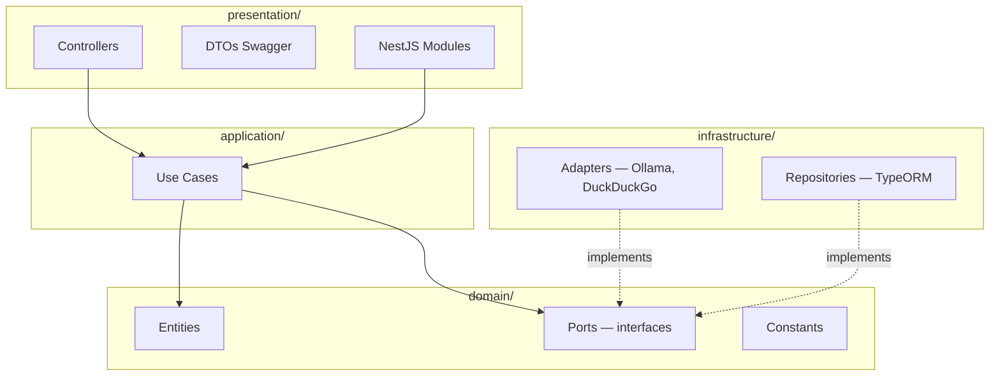
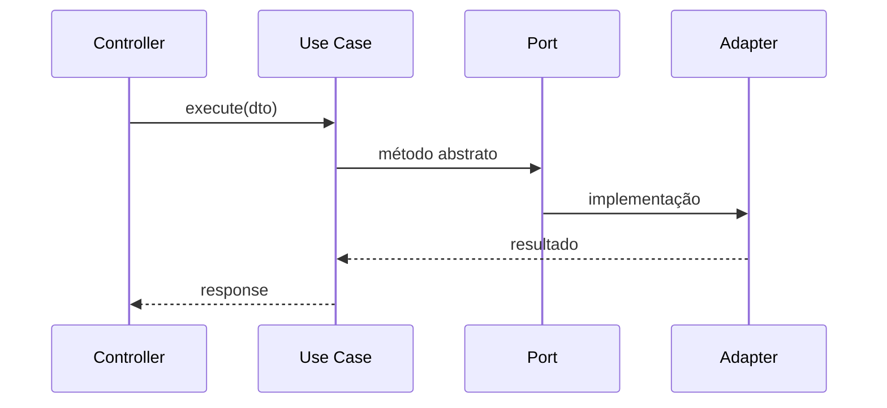

# Clean Architecture — Microserviços

Skill correspondente à regra `.cursor/rules/clean-architecture.mdc`.

## Camadas



## Regras de Dependência

```mermaid
flowchart LR
    D[domain] --> A[application]
    A --> P[presentation]
    I[infrastructure] -.->|implements ports| D

    style D fill:#1e3a5f,stroke:#22d3ee
```



| Camada | Pode importar de |
|--------|------------------|
| domain | Apenas domain |
| application | domain |
| infrastructure | domain, application (ports) |
| presentation | application, domain (DTOs) |

## Fluxo de uma Request



## Exemplo de Use Case

```typescript
@Injectable()
export class SendMessageUseCase {
  constructor(
    @Inject(AI_PORT) private readonly ai: AiPort,
    @Inject(CONVERSATION_STORE) private readonly store: ConversationStorePort,
  ) {}

  async execute(dto: SendMessageDto): Promise<SendMessageOutput> {
    const sessionId = dto.sessionId ?? this.store.createSession();
    const history = this.store.getMessages(sessionId);
    return this.ai.generateResponse(history, dto.message);
  }
}
```

## Nomenclatura

| Tipo | Padrão | Exemplo |
|------|--------|---------|
| Use case | `{Verbo}{Entidade}UseCase` | `AuthenticateUserUseCase` |
| Port | `{Entidade}Port` | `AiPort`, `SearchPort` |
| Adapter | `{Tech}Adapter` | `OllamaAdapter` |
| Symbol DI | `{NOME}_PORT` | `AI_PORT` |

## Checklist ao Criar Feature

- [ ] Port em `domain/ports/`
- [ ] Use case em `application/use-cases/`
- [ ] Adapter em `infrastructure/`
- [ ] Controller fino em `presentation/`
- [ ] Binding DI no module

## Skills Relacionadas

- [solid-principles](solid-principles/SKILL.md)
- [nestjs-services](nestjs-services/SKILL.md)
- [project-architecture](project-architecture/SKILL.md)
