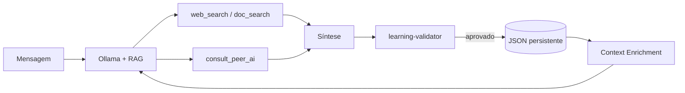

# Continuous Learning — JARVIS

Skill correspondente à regra `.cursor/rules/continuous-learning.mdc`.

## Arquitetura

## Componentes

| Arquivo | Função |
|---------|--------|
| `file-learning-store.adapter.ts` | Persistência em JSON (volume Docker) |
| `learning-validator.ts` | Bloqueia conteúdo antiético/ilegal |
| `learning-extractor.ts` | Decide o que salvar |
| `context-enrichment.service.ts` | Injeta RAG + memória no prompt |
| `ollama-peer.adapter.ts` | Consulta outros modelos Ollama |

## Variáveis

- `LEARNING_DATA_PATH` — caminho do arquivo JSON
- `LEARNING_MAX_ENTRIES` — limite (padrão 500)
- `OLLAMA_PEER_MODELS` — ex.: `mistral,gemma2`

## API

- `GET /api/learning/stats` — estatísticas (via gateway)
- Health inclui `learning.enabled` e breakdown RAG

## Regras

1. Nunca persistir ataques, malware, fraude, ódio ou conteúdo proibido
2. Aprendizado explícito: "aprenda", "guarde", "memorize"
3. Aprendizado implícito: após buscas com síntese útil
4. Peer AI: validar resposta antes de absorver
