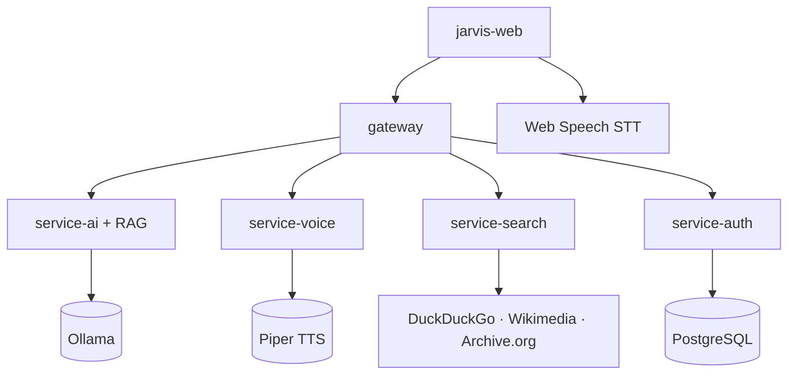

# Stack Gratuito — Sem Licenças Pagas

Skill correspondente à regra `.cursor/rules/free-open-source-stack.mdc`.

Documentação completa: [docs/free-stack.md](../../docs/free-stack.md)

## Mapa do Stack



## Proibido Adicionar

- OpenAI, Anthropic, Google Gemini API (pagos por token)
- SerpAPI, Bing Search API (pagos)
- Unsplash, YouTube Data API, Spotify como dependência **obrigatória**
- Qualquer SDK que exija chave comercial paga

## Matriz Gratuita (usar sempre)

| Necessidade | Solução | Licença |
|-------------|---------|---------|
| IA / Chat | Ollama + Llama 3.2 | MIT |
| RAG / Embeddings | Ollama + nomic-embed-text | Apache 2.0 |
| Busca web | DuckDuckGo + duck-duck-scrape | MIT |
| Imagens | DuckDuckGo + Wikimedia Commons | MIT / CC |
| Vídeos | DuckDuckGo Videos | MIT |
| Música | Internet Archive | Domínio público |
| STT | Web Speech API (browser, pt-BR) | W3C |
| TTS | Piper (`pt_BR-faber-medium`) + fallback browser | MIT / W3C |
| Backend | NestJS | MIT |
| Frontend | Next.js | MIT |
| DB | PostgreSQL | PostgreSQL License |

## Ollama (IA local + RAG)

```bash
docker compose up -d ollama
# Modelos baixados via ollama-init no Docker (llama3.2 + nomic-embed-text)
```

Variáveis:
- `OLLAMA_BASE_URL=http://localhost:11434`
- `OLLAMA_MODEL=llama3.2`
- `OLLAMA_EMBED_MODEL=nomic-embed-text`

Adapters:
- Chat: `services/service-ai/src/infrastructure/adapters/ollama.adapter.ts`
- RAG: `services/service-ai/src/infrastructure/adapters/ollama-rag.adapter.ts`

## Piper TTS

Variáveis: `PIPER_URL`, `PIPER_VOICE`, `PIPER_LENGTH_SCALE`

Adapter: `services/service-voice/src/infrastructure/adapters/piper-voice.adapter.ts`

## Checklist ao Integrar Nova Feature

1. [ ] Licença verificada (MIT, Apache 2.0, BSD ou domínio público)
2. [ ] Sem API key paga obrigatória
3. [ ] Documentado em `docs/free-stack.md`
4. [ ] `.env.example` sem vars de serviços pagos
5. [ ] Regra `.cursor/rules/free-open-source-stack.mdc` respeitada

## Onde Está no Código

| Serviço | Adapter / Implementação |
|---------|-------------------------|
| service-ai | `OllamaAdapter`, `OllamaRagAdapter` |
| service-search | `FreeSearchAdapter` (duck-duck-scrape) |
| service-voice | `PiperVoiceAdapter` (TTS); STT via browser |
| jarvis-web | `useVoice.ts` (Web Speech STT + Piper TTS via API) |

## Skills Relacionadas

- [myjarvis-development](myjarvis-development/SKILL.md)
- [nestjs-services](nestjs-services/SKILL.md)
