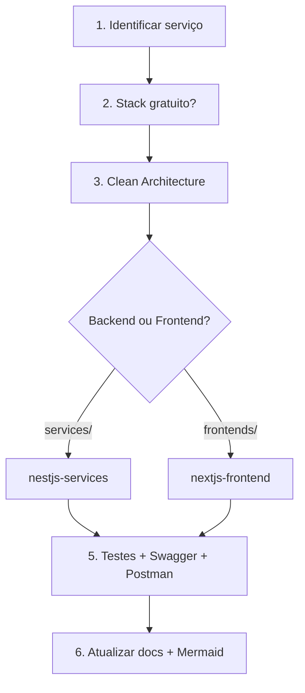

# MyJarvis Development

Skill principal de workflow. Carregue skills específicas conforme o domínio.

## Índice de Skills

| Skill | Quando carregar |
|-------|-----------------|
| [project-architecture](project-architecture/SKILL.md) | Estrutura, portas, Docker, novo serviço |
| [clean-architecture](clean-architecture/SKILL.md) | Use cases, ports, camadas |
| [solid-principles](solid-principles/SKILL.md) | Review, refatoração, nomenclatura |
| [nestjs-services](nestjs-services/SKILL.md) | Backend, APIs, Swagger, testes |
| [nextjs-frontend](nextjs-frontend/SKILL.md) | UI, PWA, voz, Zustand |
| [free-open-source-stack](free-open-source-stack/SKILL.md) | Dependências, integrações externas |

Índice completo: [.cursor/skills/README.md](README.md)

## Fluxo ao Implementar Features



Skills: `project-architecture` → `free-open-source-stack` → `clean-architecture` → `nestjs-services` | `nextjs-frontend`

## Comandos Essenciais

```bash
# Infra completa
docker compose up -d --build
docker compose exec ollama ollama pull llama3.2

# Desenvolvimento
npm run start:dev -w service-gateway
npm run start:dev -w service-ai
npm run dev -w jarvis-web

# Testes
npm test
npm run test -w service-ai
```

## Personalidade JARVIS (service-ai)

System prompt em `services/service-ai/src/domain/constants/jarvis-prompt.ts`:

- Tom britânico elegante, inteligente, levemente irônico
- Proativo como assistente pessoal
- Humor sutil quando apropriado
- Responde no idioma do usuário (padrão: português)

## Integrações por Serviço

| Serviço | Integração gratuita |
|---------|---------------------|
| service-ai | Ollama `/api/chat` + tool calling |
| service-search | DuckDuckGo, Wikimedia, Archive.org |
| service-voice | Metadados `clientSide: true` |
| jarvis-web | Web Speech API (STT/TTS) |

## Documentação a Atualizar

Ao mudar funcionalidades, sempre:

1. Swagger decorators
2. Testes Vitest
3. `docs/postman/myjarvis.postman_collection.json`
4. `docs/insomnia/myjarvis.insomnia.json`
5. `docs/api.md` + README do serviço

## Rules Correspondentes

Cada skill tem regra em `.cursor/rules/` com o mesmo nome (exceto `myjarvis-development`, que agrega todas).
