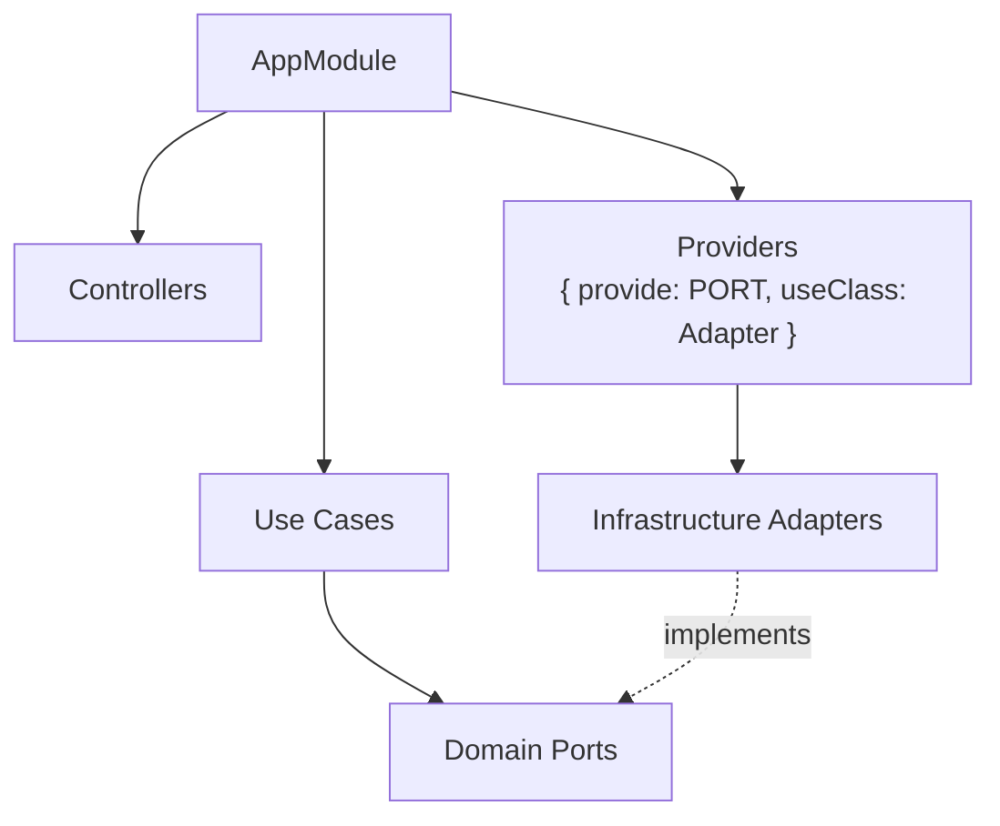

# NestJS Microservices

Skill correspondente à regra `.cursor/rules/nestjs-services.mdc`.

## Estrutura de Módulo



```typescript
@Module({
  imports: [ConfigModule.forRoot({ isGlobal: true }), HttpModule],
  controllers: [ChatController, HealthController],
  providers: [
    SendMessageUseCase,
    { provide: AI_PORT, useClass: OllamaAdapter },
    { provide: CONVERSATION_STORE, useClass: InMemoryConversationStore },
  ],
})
export class AppModule {}
```

## Bootstrap Padrão (`main.ts`)

```typescript
app.enableCors();
app.useGlobalPipes(new ValidationPipe({ whitelist: true, transform: true }));
app.setGlobalPrefix('api');
SwaggerModule.setup('api/docs', app, SwaggerModule.createDocument(app, config));
```

## Swagger (obrigatório)

- Controllers: `@ApiTags`, `@ApiOperation`, `@ApiResponse`, `@ApiBearerAuth` quando protegido
- DTOs: `@ApiProperty` / `@ApiPropertyOptional` em cada campo
- URL: `http://localhost:{PORTA}/api/docs`

## Health Check

Todo serviço expõe `GET /api/health` (prefixo global `/api`):

```typescript
@Controller('health')
export class HealthController {
  @Get()
  check() {
    return { status: 'ok', service: 'service-name', version: '1.0.0', uptime: process.uptime() };
  }
}
```

`service-ai` inclui status RAG: `{ rag: { ready, embedModel, chunks: 8 } }`.

## Testes (Vitest)

| Tipo | O quê mockar | Onde |
|------|--------------|------|
| Unit | Ports (AI_PORT, SEARCH_PORT) | `test/*.spec.ts` |
| Use case | Repositórios e adapters | Ao lado ou em `test/` |

```bash
npm run test -w service-ai
npm run test:watch -w service-auth
```

## Checklist ao Modificar APIs

1. [ ] Atualizar DTOs e decorators Swagger
2. [ ] Atualizar use cases e ports se necessário
3. [ ] Atualizar testes Vitest
4. [ ] Atualizar `docs/postman/myjarvis.postman_collection.json`
5. [ ] Atualizar `docs/insomnia/myjarvis.insomnia.json`
6. [ ] Atualizar `docs/api.md` e README do serviço

## Serviços do Projeto

| Serviço | Porta | Foco |
|---------|-------|------|
| service-gateway | 3000 | Proxy HTTP |
| service-auth | 3001 | JWT + PostgreSQL |
| service-ai | 3002 | Ollama + RAG + chat JARVIS |
| service-voice | 3003 | Piper TTS + metadados STT client-side |
| service-search | 3004 | DuckDuckGo, Wikimedia |
| service-notifications | 3005 | Notificações in-memory |
| service-media | 3006 | Mídia reproduzível |

## Skills Relacionadas

- [clean-architecture](clean-architecture/SKILL.md)
- [free-open-source-stack](free-open-source-stack/SKILL.md)
- [project-architecture](project-architecture/SKILL.md)
