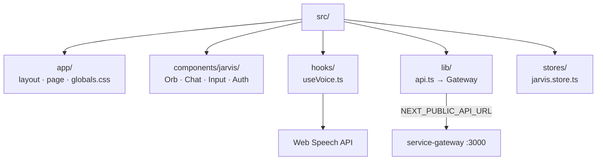

# Next.js Frontend — jarvis-web

Skill correspondente à regra `.cursor/rules/nextjs-frontend.mdc`.

## Stack

| Tecnologia | Uso |
|------------|-----|
| Next.js 15 | App Router |
| TypeScript | strict mode |
| Tailwind CSS | Estilos + tema JARVIS |
| Framer Motion | Animações do orb |
| Zustand | Estado global (chat, sessão, auth) |
| Vitest + Testing Library | Testes |

## Estrutura



## UI/UX JARVIS

- **Tema**: escuro — `#0a0e17`, ciano `#22d3ee`, dourado sutil `#fbbf24`
- **Orb central**: pulso animado quando ouvindo/processando
- **Mobile-first**: PWA via `public/manifest.json`
- **Acessibilidade**: ARIA labels, contraste WCAG AA
- **Tipografia**: Inter (UI), JetBrains Mono (status)

## API (via Gateway)

```typescript
// lib/api.ts — sempre NEXT_PUBLIC_API_URL
const API_URL = process.env.NEXT_PUBLIC_API_URL ?? 'http://localhost:3000';
// Token JWT em localStorage → header Authorization
```

Endpoints usados:
- `POST /api/auth/login`, `/register`
- `POST /api/chat/session`, `/message`
- Nunca chamar serviços internos (3001–3006) diretamente

## Voz (STT browser + TTS Piper)

| Função | API / Serviço | Arquivo |
|--------|---------------|---------|
| STT | `SpeechRecognition` (pt-BR) | `hooks/useVoice.ts` |
| TTS | Piper via `POST /api/voice/synthesize` | `hooks/useVoice.ts`, `lib/api.ts` |
| Fallback TTS | `speechSynthesis` pt-BR | `hooks/useVoice.ts` |

Requisitos STT: Chrome/Edge, HTTPS ou localhost, permissão de microfone.

## Testes

```bash
npm run test -w jarvis-web
```

- Mock `window.SpeechRecognition` e `speechSynthesis` nos testes de voz
- Testing Library para stores e componentes

## Comandos

```bash
npm run dev -w jarvis-web      # http://localhost:3100
npm run build -w jarvis-web
```

## Skills Relacionadas

- [project-architecture](project-architecture/SKILL.md) — portas e gateway
- [free-open-source-stack](free-open-source-stack/SKILL.md) — voz no browser
- [myjarvis-development](myjarvis-development/SKILL.md) — fluxo geral
