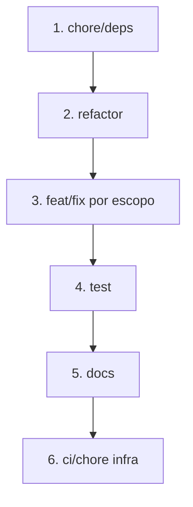

# Organize Commits

Todo commit deve ser **atômico** (uma intenção clara), **revisável** e **passar no CI** sozinho quando possível.

**Nunca** junte refatoração + feature + docs + deps no mesmo commit.

Integração: após todos os commits, rodar [review-code](../review-code/SKILL.md) (`npm run ci:pipeline`) antes do push.

---

## Workflow do agente (obrigatório ao commitar)

### 1. Inventariar mudanças

```bash
git status
git diff
git diff --staged
git log -3 --format="%s"
```

### 2. Agrupar por intenção

Classifique cada arquivo alterado em **um único grupo**. Se um arquivo serve a dois grupos, **divida a edição** em commits separados (stash parcial ou `git add -p`).

Ordem recomendada de commits (dependências primeiro):



### 3. Planejar antes de executar

Apresente o plano ao usuário (ou siga silenciosamente se pediu commit direto):

```markdown
## Plano de commits

| # | Tipo | Escopo | Arquivos | Mensagem proposta |
|---|------|--------|----------|-------------------|
| 1 | chore | deps | package.json, package-lock.json | ... |
| 2 | feat | service-ai | services/service-ai/... | ... |
| 3 | test | service-ai | services/service-ai/test/... | ... |
| 4 | docs | api | docs/api.md | ... |
```

### 4. Executar um commit por vez

Para cada linha do plano:

```bash
git add <arquivos do grupo>
git commit -m "$(cat <<'EOF'
tipo(escopo): descrição imperativa curta

Corpo opcional: por que, não o quê. Uma linha em branco antes do corpo.
EOF
)"
git status   # confirmar que só restam arquivos dos próximos grupos
```

**Regras:**
- Um `git commit` por grupo — nunca `git add .` cego com tudo misturado
- Se um commit quebrar o build, corrigir **naquele** commit antes do próximo
- Não commitar `.env`, secrets, `node_modules`, artefatos de build

### 5. Validar histórico

```bash
git log --oneline -n <N>   # N = número de commits criados
```

Cada linha deve ser compreensível isoladamente.

---

## Formato — Conventional Commits

```
tipo(escopo): descrição no imperativo, ≤72 chars
```

| Tipo | Quando usar |
|------|-------------|
| `feat` | Nova funcionalidade |
| `fix` | Correção de bug |
| `refactor` | Mudança interna sem alterar comportamento |
| `test` | Só testes |
| `docs` | Só documentação |
| `chore` | Manutenção, deps, configs sem lógica de produto |
| `ci` | Pipeline, hooks, GitHub Actions |
| `build` | Docker, build scripts |
| `style` | Formatação sem mudança lógica |

### Escopos MyJarvis (preferir estes)

| Escopo | Caminho |
|--------|---------|
| `gateway` | `services/service-gateway` |
| `auth` | `services/service-auth` |
| `ai` | `services/service-ai` |
| `voice` | `services/service-voice` |
| `search` | `services/service-search` |
| `notifications` | `services/service-notifications` |
| `media` | `services/service-media` |
| `web` | `frontends/jarvis-web` |
| `shared` | `packages/shared` |
| `tests` | `tests/`, suíte cross-service |
| `docs` | `docs/`, README, AGENTS |
| `cursor` | `.cursor/` |
| `ci` | `.github/`, `.husky/`, `scripts/ci/` |
| `docker` | `docker-compose.yml`, Dockerfiles |
| `deps` | lockfile / dependências multi-workspace |

Escopo omitido só quando a mudança é transversal e pequena: `chore: atualiza engines no package.json raiz`.

---

## Como separar (regras de ouro)

| Situação | Ação |
|----------|------|
| Feature + testes da feature | **Dois commits**: `feat` depois `test` (ou um só se teste mínimo e inseparável) |
| Feature + Swagger + Postman | `feat` no código; `docs` no Postman/Insomnia se grande; Swagger junto ao feat se pequeno |
| Bugfix + refactor no mesmo arquivo | **Dois commits**: refactor primeiro, fix depois |
| Vários microserviços alterados | **Um commit por serviço** (ou por feature cross-cutting claramente nomeada) |
| `package-lock.json` + código | Lockfile no commit `chore(deps)` ou junto ao commit que adicionou a dep |
| `.cursor` skill + código da feature | **Separar**: `cursor` e `feat`/`fix` |
| WIP / debug / console.log | Remover antes de commitar — nunca commitar |

---

## O que NÃO commitar

- `.env`, credenciais, tokens
- `dist/`, `.next/`, `coverage/`
- Alterações acidentais de formatação em arquivos não relacionados
- Commits vazios ou "fix", "update", "changes" sem contexto

---

## Mensagens — qualidade

**Bom:**
```
feat(ai): adiciona fallback quando Ollama está offline
fix(gateway): corrige timeout no proxy para service-search
test(auth): cobre registro duplicado na integração
docs(api): documenta endpoints de voz client-side
ci: adiciona pipeline em três etapas com Husky pre-push
```

**Ruim:**
```
update files
fix bug
WIP
Enhance documentation and architecture diagrams for MyJarvis project...
```

Descrição: **imperativo**, presente ("adiciona" não "adicionado"), sem ponto final, foco no **porquê** no corpo se necessário.

---

## Exemplos MyJarvis

Ver [examples.md](examples.md) para cenários completos de divisão.

---

## Checklist antes de finalizar

```
- [ ] Cada commit tem uma única intenção
- [ ] Mensagens seguem tipo(escopo): descrição
- [ ] Nenhum secret ou artefato incluído
- [ ] Ordem lógica (deps → código → testes → docs → ci)
- [ ] git log --oneline legível
- [ ] Usuário pediu push? → carregar review-code e ci:pipeline
```
