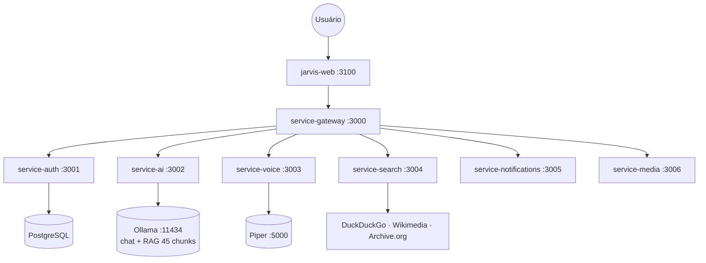
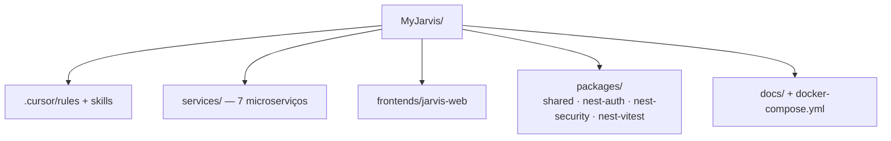

# Project Architecture — MyJarvis

Skill correspondente à regra `.cursor/rules/project-architecture.mdc`.

> **Diagramas**: usar Mermaid em docs e README — renderiza nativamente no GitHub.

## Visão do Sistema

Documentação completa: [docs/architecture.md](../../../docs/architecture.md)

## Monorepo

## Regras Obrigatórias

- Cada microserviço é independente: `package.json`, Dockerfile, testes próprios
- Comunicação entre serviços via HTTP REST (ou Redis/RabbitMQ no futuro)
- **Gateway** (`service-gateway`) é o único ponto de entrada externo
- Frontend consome **apenas** o Gateway — nunca serviços internos diretamente
- Secrets em `.env` — nunca commitar credenciais
- Ao alterar arquitetura: atualizar Mermaid em `docs/architecture.md` e README

## Portas Padrão

| Serviço | Porta |
|---------|-------|
| service-gateway | 3000 |
| service-auth | 3001 |
| service-ai | 3002 |
| service-voice | 3003 |
| service-search | 3004 |
| service-notifications | 3005 |
| service-media | 3006 |
| jarvis-web | 3100 |
| Ollama | 11434 |
| Piper TTS | 5000 |

## Skills Relacionadas

- [clean-architecture](clean-architecture/SKILL.md)
- [nestjs-services](nestjs-services/SKILL.md)
- [nextjs-frontend](nextjs-frontend/SKILL.md)
- [free-open-source-stack](free-open-source-stack/SKILL.md)
- [myjarvis-development](myjarvis-development/SKILL.md)
