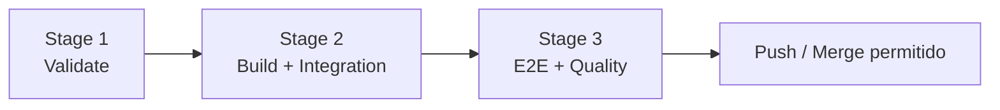

# Review Code & CI/CD (3 Etapas)

Todo código **deve passar pelas três etapas** antes de subir (push). Localmente o hook `pre-push` executa o pipeline; no remoto, o GitHub Actions bloqueia merge se alguma etapa falhar.

## Pipeline — visão geral



| Etapa | Nome | Objetivo | Comando local |
|-------|------|----------|---------------|
| **1** | Validate | Lint, testes unitários, feedback rápido | `npm run ci:stage1` |
| **2** | Build & Integration | Compilação + testes de integração in-process | `npm run ci:stage2` |
| **3** | E2E & Quality Gate | Playwright E2E + auditoria de dependências | `npm run ci:stage3` |

Pipeline completo: `npm run ci:pipeline`

Detalhes técnicos: [ci-stages.md](ci-stages.md)  
Checklist de review humano/agente: [checklist.md](checklist.md)

---

## Workflow do agente (obrigatório antes de push)

Ao finalizar alterações e **antes** de sugerir commit/push:

```
Progresso CI:
- [ ] Etapa 1 — npm run ci:stage1
- [ ] Etapa 2 — npm run ci:stage2
- [ ] Etapa 3 — npm run ci:stage3
- [ ] Code review (checklist.md) — sem 🔴 Critical
```

1. Executar `npm run ci:pipeline` (ou etapas separadas se falhar, corrigir e repetir).
2. Aplicar [checklist.md](checklist.md) nos arquivos alterados.
3. Só então criar commit ou orientar push — **nunca** pular etapas.
4. Ao commitar: carregar [organize-commits](../organize-commits/SKILL.md) — commits atômicos separados.
5. Se o usuário pedir push e o pipeline não rodou, rodar primeiro.

---

## Code review — formato de saída

```markdown
# Code Review — [escopo]

## Veredito
✅ Aprovado | ⚠️ Aprovado com ressalvas | ❌ Bloqueado

## Etapas CI
| Etapa | Status |
|-------|--------|
| 1 Validate | pass / fail |
| 2 Build+Integration | pass / fail |
| 3 E2E+Quality | pass / fail |

## Findings
### 🔴 Critical (bloqueia merge)
- ...

### 🟡 Suggestion
- ...

### 🟢 Nice to have
- ...

## MyJarvis-specific
- [ ] Clean Architecture respeitada
- [ ] Stack 100% gratuita (sem APIs pagas)
- [ ] Testes cobrem o comportamento alterado
```

Prioridade de severidade: **Critical > Suggestion > Nice to have**.

---

## Integração com o projeto MyJarvis

Carregar também quando relevante:

| Contexto | Skill |
|----------|-------|
| Camadas e ports | [clean-architecture](../clean-architecture/SKILL.md) |
| SOLID / nomenclatura | [solid-principles](../solid-principles/SKILL.md) |
| Backend NestJS | [nestjs-services](../nestjs-services/SKILL.md) |
| Frontend | [nextjs-frontend](../nextjs-frontend/SKILL.md) |
| Dependências externas | [free-open-source-stack](../free-open-source-stack/SKILL.md) |

---

## Enforcement

| Camada | Mecanismo |
|--------|-----------|
| Local | Husky `pre-push` → `npm run ci:pipeline` |
| Remoto | `.github/workflows/ci.yml` — jobs encadeados com `needs` |
| Branch protection | Configurar no GitHub: exigir os 3 jobs em `main` |

Bypass de emergência (só com aprovação explícita do usuário):

```bash
git push --no-verify
```

---

## Quando falha uma etapa

1. Ler o log da etapa que falhou.
2. Corrigir a causa raiz (não silenciar testes).
3. Reexecutar **da etapa falha até a 3** (não pular intermediárias).
4. Atualizar testes se o comportamento mudou intencionalmente.

Etapa 1 típica: lint, teste unitário quebrado.  
Etapa 2: build TypeScript, integração NestJS/DI.  
Etapa 3: E2E Playwright, `npm audit` high/critical.
