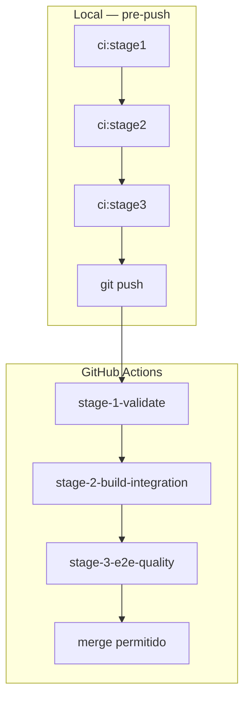

# CI/CD — Três Etapas (referência)

## Stage 1 — Validate (~2–5 min)

**Objetivo:** feedback rápido; falhar cedo.

```bash
npm run ci:stage1
```

Inclui:
- `npm run lint --workspaces --if-present`
- `npm run test:unit --workspaces --if-present`

GitHub job: `stage-1-validate`

---

## Stage 2 — Build & Integration (~5–10 min)

**Objetivo:** garantir que o monorepo compila e os serviços se integram in-process.

```bash
npm run ci:stage2
```

Inclui:
- `npm run build --workspaces --if-present`
- `npm run test:integration --workspaces --if-present`
- `npm run test:integration -w @myjarvis/test-suite` (live skipped se offline)

GitHub job: `stage-2-build-integration` (depende de stage 1)

---

## Stage 3 — E2E & Quality Gate (~5–15 min)

**Objetivo:** validar fluxo de usuário e dependências críticas.

```bash
npm run ci:stage3
```

Inclui:
- `npx playwright install chromium` (CI)
- `npm run test:e2e -w jarvis-web`
- `node scripts/ci/audit-gate.mjs` (critical em prod bloqueia; high = warning)

GitHub job: `stage-3-e2e-quality` (depende de stage 2)

---

## Branch protection (GitHub)

Settings → Branches → Branch protection rules → `main`:

1. Require status checks: `Stage 1 — Validate`, `Stage 2 — Build & Integration`, `Stage 3 — E2E & Quality Gate`
2. Require branches up to date before merging
3. (Opcional) Require pull request reviews

---

## Arquivos do pipeline

| Arquivo | Função |
|---------|--------|
| `.github/workflows/ci.yml` | Pipeline remoto encadeado |
| `.husky/pre-push` | Bloqueia push local se pipeline falhar |
| `package.json` → `ci:stage*` | Scripts das etapas |

---

## Diagrama completo


