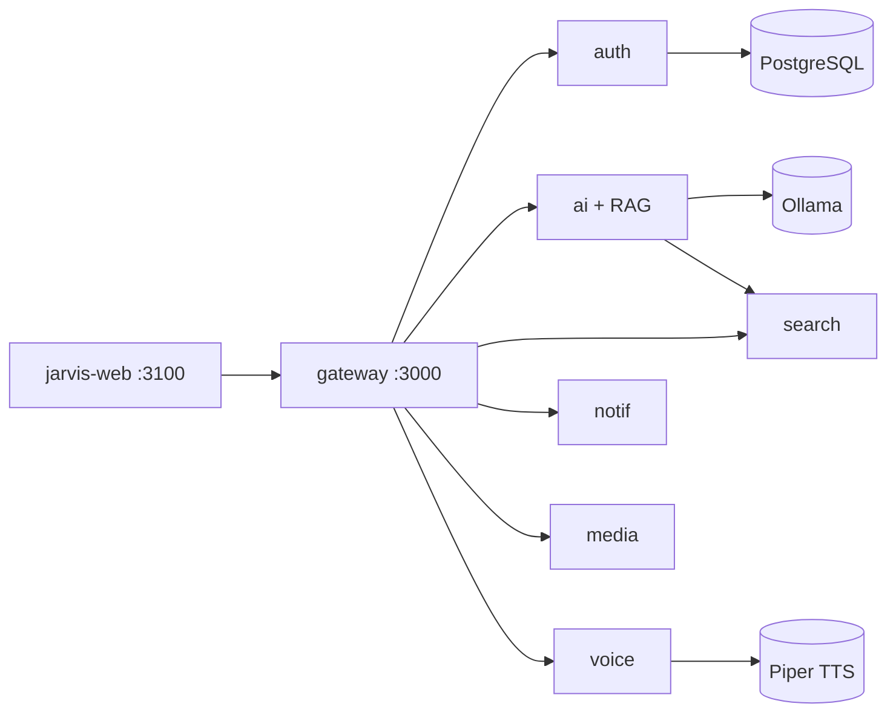

# MyJarvis — Agent Guidelines

## Project Structure

- `services/` — NestJS microservices (Clean Architecture)
- `frontends/jarvis-web/` — Next.js PWA
- `packages/` — `@myjarvis/shared`, `nest-auth`, `nest-security`, `nest-vitest`
- `docs/` — Documentation, Postman, Insomnia collections

## Cursor — Rules & Skills

- **Rules** (`.cursor/rules/`): contexto automático por glob ou alwaysApply
- **Skills** (`.cursor/skills/`): guia detalhado — uma skill por regra + orquestrador

| Regra | Skill |
|-------|-------|
| `project-architecture` | `project-architecture` |
| `clean-architecture` | `clean-architecture` |
| `solid-principles` | `solid-principles` |
| `nestjs-services` | `nestjs-services` |
| `nextjs-frontend` | `nextjs-frontend` |
| `free-open-source-stack` | `free-open-source-stack` |
| `dev-agent` | `dev-agent` |
| `safety-guardrails` | `safety-guardrails` |
| — | `myjarvis-development` |
| — | `review-code` · `organize-commits` |

Comece por `myjarvis-development` e carregue a skill do domínio. Índice: `.cursor/skills/README.md`

Documentação legal: [docs/terms-of-use.md](docs/terms-of-use.md) · [docs/privacy-policy.md](docs/privacy-policy.md)

## When Modifying Code

1. Follow `.cursor/rules/` and load matching `.cursor/skills/` when needed
2. Update Swagger decorators on API changes
3. Update Vitest tests
4. Update `docs/postman/` and `docs/insomnia/` collections
5. Update relevant README files and Mermaid diagrams in `docs/`

## Key Commands

```bash
docker compose up -d --build   # Full stack (ollama-init + piper)
npm test                       # All tests
npm run dev -w jarvis-web      # Frontend only
```

## Architecture Principles

- SOLID, Clean Architecture, Clean Code
- Domain → Application → Infrastructure → Presentation
- Gateway as single external entry point
- **RAG** in `service-ai`: Ollama embeddings + 32 knowledge chunks (ações + dev + ética; índice `knowledge-index.ts`, sem vector DB)
- **Dev Agent**: JARVIS code review, refactoring, blueprint, `doc_search` — `.cursor/skills/dev-agent/`
- **Safety Guardrails**: recusa de ataques e ilegalidades — `.cursor/skills/safety-guardrails/`
- **Termos de Uso**: aceite único (`termsAcceptedAt`, versão `2026-06-01`) — [docs/terms-of-use.md](docs/terms-of-use.md)
- **Diagramas de arquitetura em Mermaid** — ver [docs/architecture.md](docs/architecture.md)


