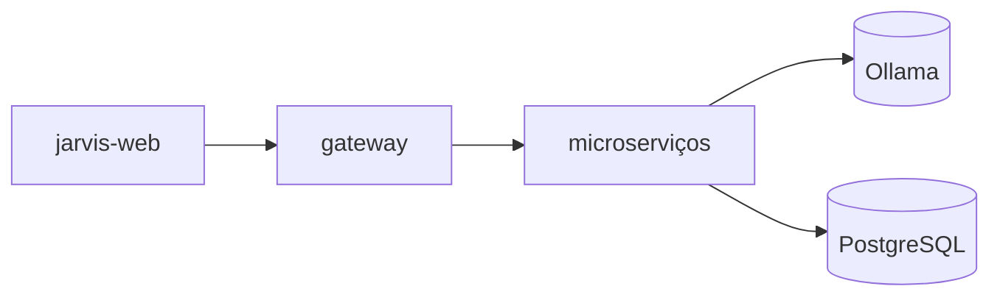

# MyJarvis — Agent Guidelines

## Project Structure

- `services/` — NestJS microservices (Clean Architecture)
- `frontends/jarvis-web/` — Next.js PWA
- `packages/shared/` — Shared types and DTOs
- `docs/` — Documentation, Postman, Insomnia collections

## Cursor — Rules & Skills

- **Rules** (`.cursor/rules/`): contexto automático por glob ou alwaysApply
- **Skills** (`.cursor/skills/`): guia detalhado — uma skill por regra + orquestrador

| Regra | Skill |
|-------|-------|
| `project-architecture` | `project-architecture` |
| `clean-architecture` | `clean-architecture` |
| `solid-principles` | `solid-principles` |
| `nestjs-services` | `nestjs-services` |
| `nextjs-frontend` | `nextjs-frontend` |
| `free-open-source-stack` | `free-open-source-stack` |
| — | `myjarvis-development` |

Comece por `myjarvis-development` e carregue a skill do domínio. Índice: `.cursor/skills/README.md`

## When Modifying Code

1. Follow `.cursor/rules/` and load matching `.cursor/skills/` when needed
2. Update Swagger decorators on API changes
3. Update Vitest tests
4. Update `docs/postman/` and `docs/insomnia/` collections
5. Update relevant README files

## Key Commands

```bash
docker compose up -d --build   # Full stack
npm test                       # All tests
npm run dev -w jarvis-web      # Frontend only
```

## Architecture Principles

- SOLID, Clean Architecture, Clean Code
- Domain → Application → Infrastructure → Presentation
- Gateway as single external entry point
- **Diagramas de arquitetura em Mermaid** — ver [docs/architecture.md](docs/architecture.md)


