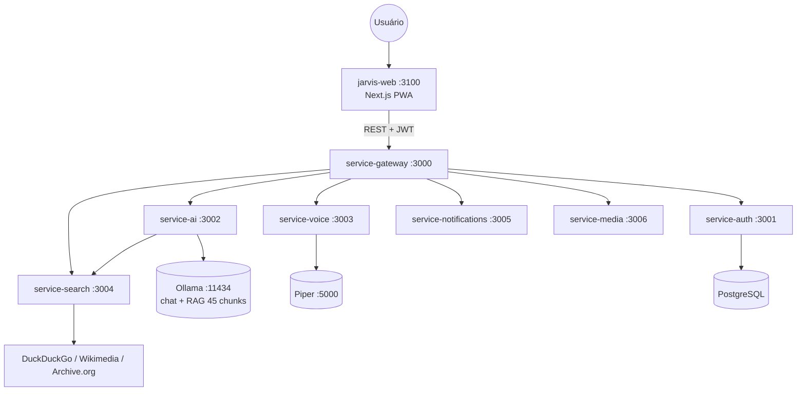

# MyJarvis

Assistente de IA pessoal **e agente de desenvolvimento** inspirado no **JARVIS** — inteligente, com humor seco, voz, buscas, code review, refatoração e orientação de arquitetura.

**Autor:** [Francisco Stanley Rodrigues Albuquerque](LICENSE)

**100% gratuito e open source** — sem APIs pagas, sem licenças comerciais.

## Stack Gratuito

| Componente | Tecnologia | Licença |
|------------|-----------|---------|
| IA / Chat | Ollama + Llama 3.2 | MIT |
| RAG / Embeddings | Ollama + nomic-embed-text | Apache 2.0 |
| Busca | DuckDuckGo, Wikimedia, Internet Archive | MIT / CC |
| Voz (STT) | Web Speech API (navegador, pt-BR) | W3C |
| Voz (TTS) | Piper (`pt_BR-faber-medium`) + fallback browser | MIT / W3C |
| Backend | NestJS | MIT |
| Frontend | Next.js PWA | MIT |

Detalhes: [docs/free-stack.md](docs/free-stack.md)

## Arquitetura



Diagramas detalhados: [docs/architecture.md](docs/architecture.md)  
Mapa de pastas: [docs/project-structure.md](docs/project-structure.md)

## Início Rápido

### Pré-requisitos

- Node.js 20+
- Docker & Docker Compose
- ~4 GB RAM livre (para Ollama)

### Setup

```bash
cp .env.example .env

# Subir infraestrutura + serviços (ollama-init baixa llama3.2 + nomic-embed-text)
docker compose up -d --build
```

### URLs

| Serviço | URL |
|---------|-----|
| Frontend | http://localhost:3100 |
| API Gateway | http://localhost:3000/api |
| Swagger (gateway) | http://localhost:3000/api/docs |
| Ollama | http://localhost:11434 |

## Microserviços

| Serviço | Porta | Tecnologia gratuita |
|---------|-------|---------------------|
| `service-gateway` | 3000 | Proxy, JWT, RBAC |
| `service-auth` | 3001 | PostgreSQL, LDAP, JWT |
| `service-ai` | 3002 | Ollama + **RAG** (45 chunks) + memória aprendida + `doc_search` + `consult_peer_ai` |
| `service-voice` | 3003 | Piper TTS (STT no browser) |
| `service-search` | 3004 | DuckDuckGo + Wikimedia + Archive.org |
| `service-notifications` | 3005 | Notificações in-memory |
| `service-media` | 3006 | URLs de mídia via search |

Infra Docker adicional: **Piper** (:5000), **ollama-init** (pull automático de modelos).

## Testes & CI/CD

Pipeline em **3 etapas** — obrigatório antes de `git push` (hook Husky + GitHub Actions):

```bash
npm run ci:stage1      # 1. Validate — lint + unitários
npm run ci:stage2      # 2. Build + integração
npm run ci:stage3      # 3. E2E + audit gate
npm run ci:pipeline    # Executa as 3 etapas
```

Skill de code review: `.cursor/skills/review-code/SKILL.md`

Outros testes:

```bash
npm run test:performance # Autocannon (requer Docker)
npm run test:stress      # Stress test
```

Documentação: [docs/testing.md](docs/testing.md)

## Documentação

- [Início Rápido](docs/getting-started.md)
- [Deployment](docs/deployment.md)
- [Variáveis de Ambiente](docs/environment-variables.md)
- [Contribuindo](docs/contributing.md)
- [Termos de Uso](docs/terms-of-use.md)
- [Política de Privacidade](docs/privacy-policy.md)
- [RBAC & LDAP](docs/rbac-ldap.md)
- [Stack gratuito](docs/free-stack.md)
- [Arquitetura](docs/architecture.md)
- [Estrutura de pastas](docs/project-structure.md)
- [API Reference](docs/api.md)
- [Testes & CI](docs/testing.md)
- [Postman](docs/postman/myjarvis.postman_collection.json)
- [Insomnia](docs/insomnia/myjarvis.insomnia.json)

> Wiki GitHub espelha `docs/` — fonte canônica no repositório.

## Variáveis de Ambiente

| Variável | Descrição |
|----------|-----------|
| `OLLAMA_BASE_URL` | URL do Ollama (padrão: http://localhost:11434) |
| `OLLAMA_MODEL` | Modelo de chat (padrão: llama3.2) |
| `OLLAMA_EMBED_MODEL` | Modelo RAG (padrão: nomic-embed-text) |
| `PIPER_URL` / `PIPER_VOICE` | TTS Piper local (pt_BR-faber-medium) |
| `SEARCH_SERVICE_URL` | URL interna do service-search |
| `JWT_SECRET` | Secret JWT (produção) |
| `DATABASE_URL` | PostgreSQL |
| `ENABLE_SWAGGER` | Swagger em produção (`true` para habilitar) |

Lista completa: [docs/environment-variables.md](docs/environment-variables.md) · [.env.example](.env.example)

## Cursor — Rules & Skills

| Regra (`.cursor/rules/`) | Skill (`.cursor/skills/`) |
|--------------------------|---------------------------|
| `project-architecture` | `project-architecture` |
| `clean-architecture` | `clean-architecture` |
| `solid-principles` | `solid-principles` |
| `nestjs-services` | `nestjs-services` |
| `nextjs-frontend` | `nextjs-frontend` |
| `free-open-source-stack` | `free-open-source-stack` |
| `dev-agent` | `dev-agent` |
| `safety-guardrails` | `safety-guardrails` |
| `christian-faith` | `christian-faith` |
| `continuous-learning` | `continuous-learning` |
| — | `myjarvis-development` (orquestrador) |
| — | `review-code` · `organize-commits` |

Índice: [.cursor/skills/README.md](.cursor/skills/README.md)

## Autor

**Francisco Stanley Rodrigues Albuquerque** — criador e mantenedor do MyJarvis.

## Licença

MIT — Copyright © 2026 Francisco Stanley Rodrigues Albuquerque. Ver [LICENSE](LICENSE).
