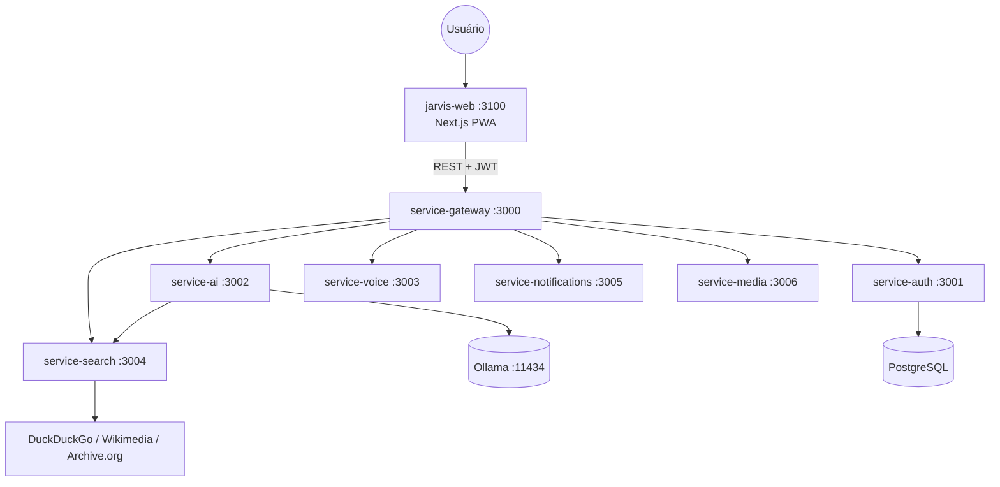

# MyJarvis

Assistente de IA pessoal inspirado no **JARVIS** — inteligente, com humor, voz, buscas na internet, imagens, vídeos e músicas.

**Autor:** [Francisco Stanley Rodrigues Albuquerque](LICENSE)

**100% gratuito e open source** — sem APIs pagas, sem licenças comerciais.

## Stack Gratuito

| Componente | Tecnologia | Licença |
|------------|-----------|---------|
| IA | Ollama + Llama 3.2 | MIT |
| Busca | DuckDuckGo, Wikimedia, Internet Archive | MIT / CC |
| Voz | Web Speech API (navegador) | W3C |
| Backend | NestJS | MIT |
| Frontend | Next.js PWA | MIT |

Detalhes: [docs/free-stack.md](docs/free-stack.md)

## Arquitetura



Diagramas detalhados: [docs/architecture.md](docs/architecture.md)  
Mapa de pastas: [docs/project-structure.md](docs/project-structure.md)

## Início Rápido

### Pré-requisitos

- Node.js 20+
- Docker & Docker Compose
- ~4 GB RAM livre (para Ollama)

### Setup

```bash
cp .env.example .env

# Subir infraestrutura + serviços
docker compose up -d --build

# Baixar modelo de IA (primeira vez)
docker compose exec ollama ollama pull llama3.2
```

### URLs

| Serviço | URL |
|---------|-----|
| Frontend | http://localhost:3100 |
| API Gateway | http://localhost:3000/api |
| Ollama | http://localhost:11434 |

## Microserviços

| Serviço | Porta | Tecnologia gratuita |
|---------|-------|---------------------|
| `service-ai` | 3002 | Ollama (LLM local) |
| `service-search` | 3004 | DuckDuckGo + Wikimedia + Archive.org |
| `service-voice` | 3003 | Web Speech API (via frontend) |
| Demais | — | NestJS + PostgreSQL + Redis |

## Testes & CI/CD

Pipeline em **3 etapas** — obrigatório antes de `git push` (hook Husky + GitHub Actions):

```bash
npm run ci:stage1      # 1. Validate — lint + unitários
npm run ci:stage2      # 2. Build + integração
npm run ci:stage3      # 3. E2E + audit gate
npm run ci:pipeline    # Executa as 3 etapas
```

Skill de code review: `.cursor/skills/review-code/SKILL.md`

Outros testes:

```bash
npm run test:performance # Autocannon (requer Docker)
npm run test:stress      # Stress test
```

Documentação: [docs/testing.md](docs/testing.md)

## Documentação

- [RBAC & LDAP](docs/rbac-ldap.md)
- [Stack gratuito](docs/free-stack.md)
- [Arquitetura](docs/architecture.md)
- [API Reference](docs/api.md)
- [Postman](docs/postman/myjarvis.postman_collection.json)

## Variáveis de Ambiente

| Variável | Descrição |
|----------|-----------|
| `OLLAMA_BASE_URL` | URL do Ollama (padrão: http://localhost:11434) |
| `OLLAMA_MODEL` | Modelo local (padrão: llama3.2) |
| `JWT_SECRET` | Secret JWT (produção) |
| `DATABASE_URL` | PostgreSQL |

## Cursor — Rules & Skills

| Regra (`.cursor/rules/`) | Skill (`.cursor/skills/`) |
|--------------------------|---------------------------|
| `project-architecture` | `project-architecture` |
| `clean-architecture` | `clean-architecture` |
| `solid-principles` | `solid-principles` |
| `nestjs-services` | `nestjs-services` |
| `nextjs-frontend` | `nextjs-frontend` |
| `free-open-source-stack` | `free-open-source-stack` |
| — | `myjarvis-development` (orquestrador) |

Índice: [.cursor/skills/README.md](.cursor/skills/README.md)

## Autor

**Francisco Stanley Rodrigues Albuquerque** — criador e mantenedor do MyJarvis.

## Licença

MIT — Copyright © 2026 Francisco Stanley Rodrigues Albuquerque. Ver [LICENSE](LICENSE).
