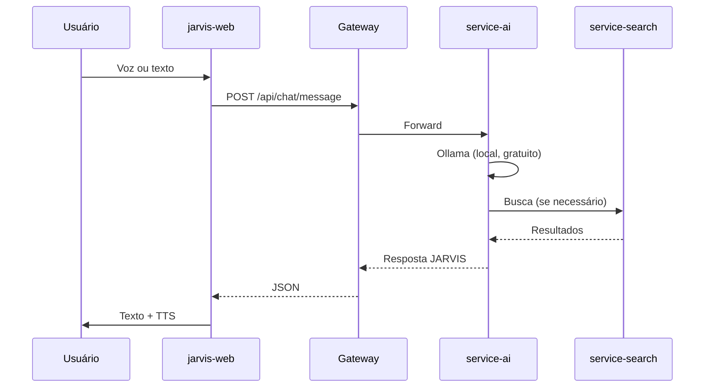

# Arquitetura MyJarvis

## Visão Geral

MyJarvis segue **Clean Architecture** com microserviços independentes, comunicando-se via HTTP REST através de um API Gateway.

## Camadas (por serviço)

```
presentation/    → Controllers, DTOs, Guards (NestJS)
application/     → Use Cases (regras de negócio)
domain/          → Entidades, Ports (interfaces)
infrastructure/  → Adapters (OpenAI, DB, HTTP clients)
```

## Fluxo de Conversa



## Decisões de Design

- **Gateway único**: Frontend nunca acessa serviços internos
- **Ports & Adapters**: OpenAI, DuckDuckGo, etc. são substituíveis
- **In-memory sessions**: Conversas em memória (Redis em produção futura)
- **PWA**: Mobile via Progressive Web App, sem app nativo separado

## Escalabilidade Futura

- Redis para sessões de conversa
- RabbitMQ para notificações assíncronas
- Kubernetes para orquestração
- Rate limiting no gateway
