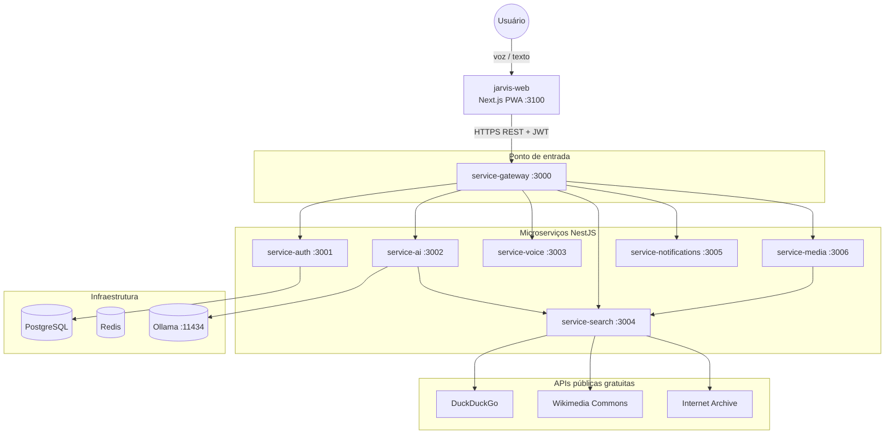
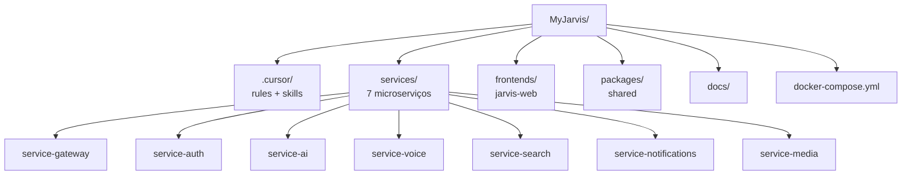
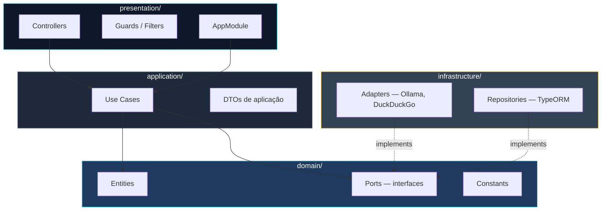
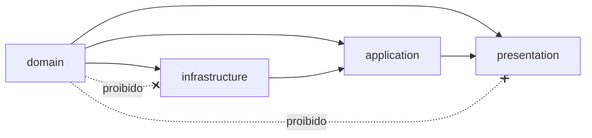
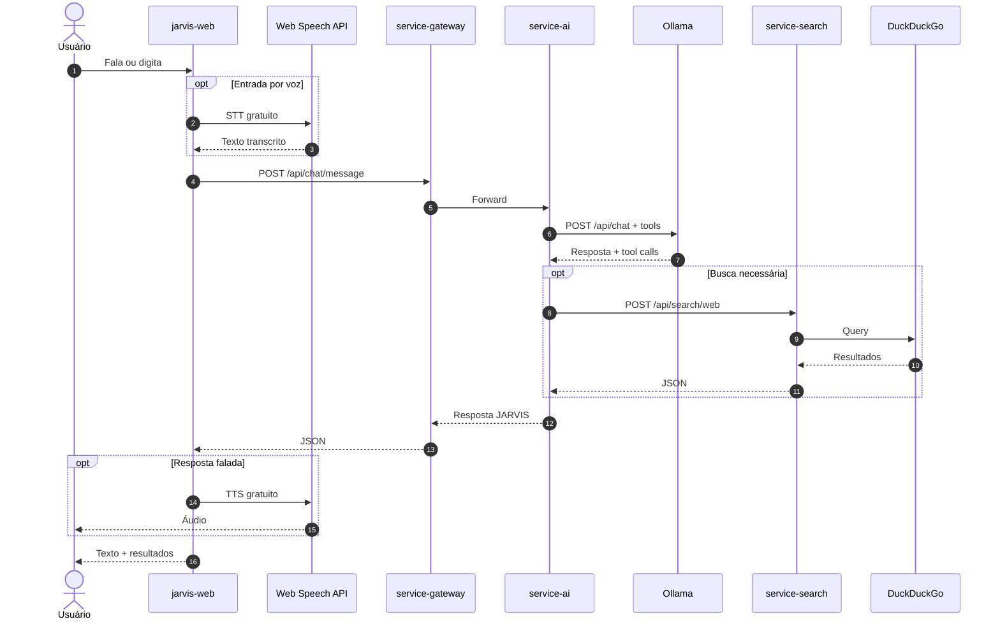
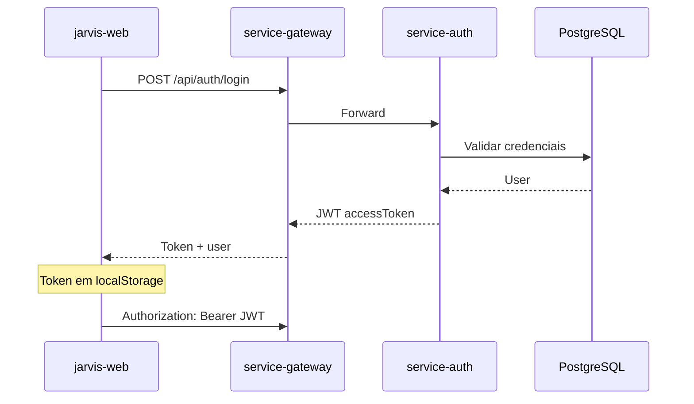
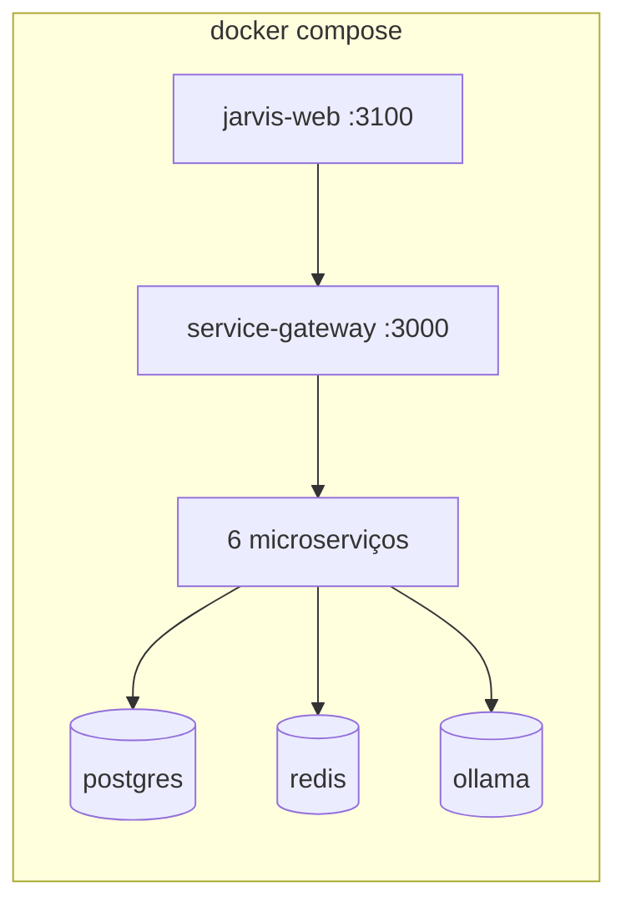
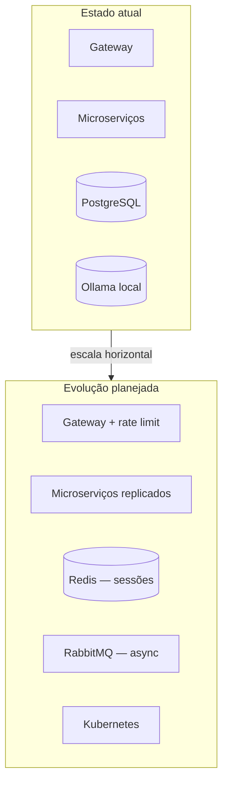

# Arquitetura MyJarvis

## Visão Geral

MyJarvis segue **Clean Architecture** com microserviços independentes, comunicando-se via HTTP REST através de um API Gateway. Stack 100% gratuita e open source.

## Contexto do Sistema

## Monorepo

## Clean Architecture (por microserviço)

### Regras de dependência

## Fluxo de Conversa JARVIS

## Autenticação

## Deploy Docker

## Decisões de Design

- **Gateway único**: frontend nunca acessa serviços internos diretamente
- **Ports & Adapters**: Ollama, DuckDuckGo etc. são substituíveis sem alterar use cases
- **Sessões in-memory**: conversas em memória (Redis em produção futura)
- **PWA**: mobile via Progressive Web App, sem app nativo separado
- **Stack gratuito**: sem APIs pagas — ver [free-stack.md](free-stack.md)

## Escalabilidade Futura

