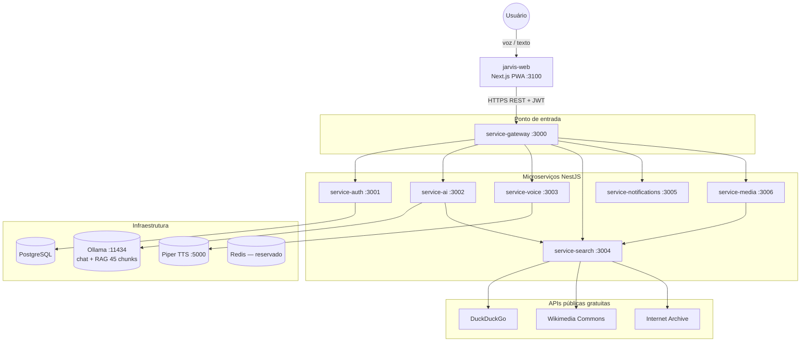
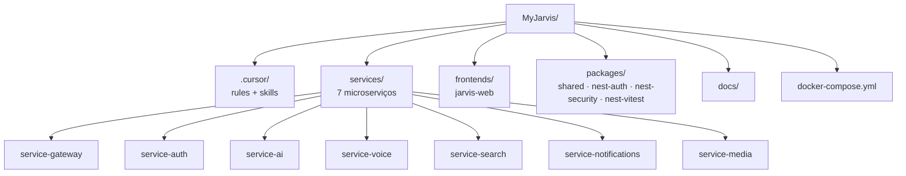
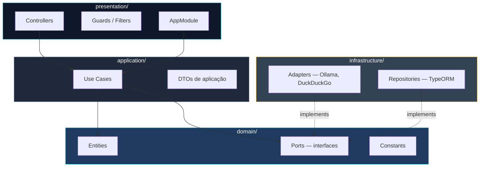
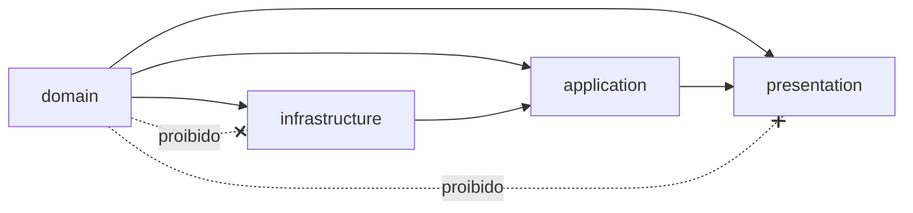
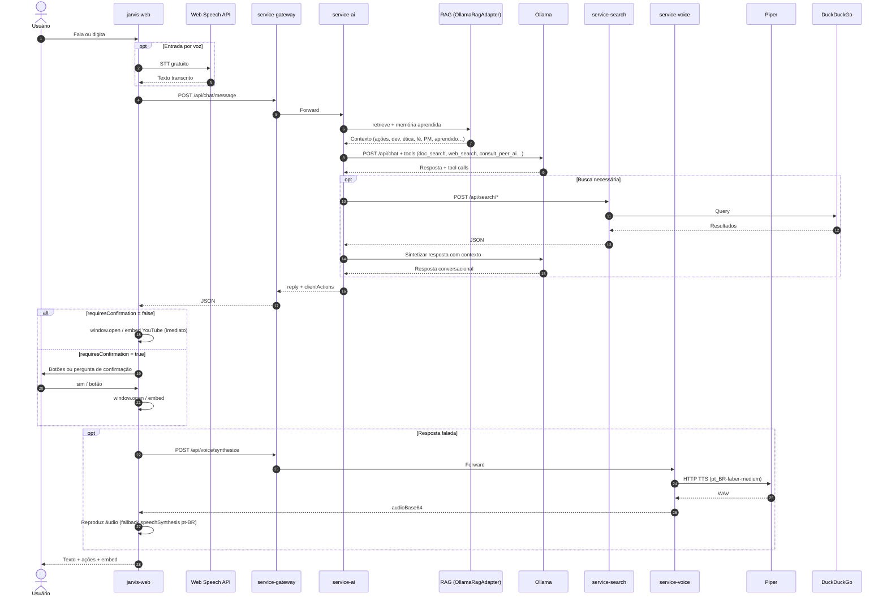
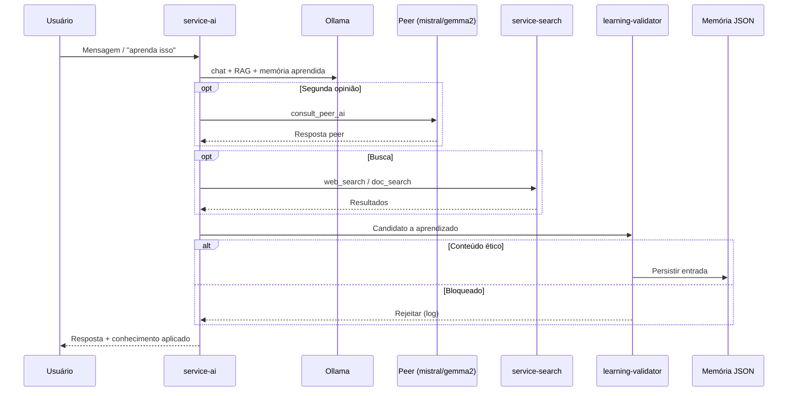
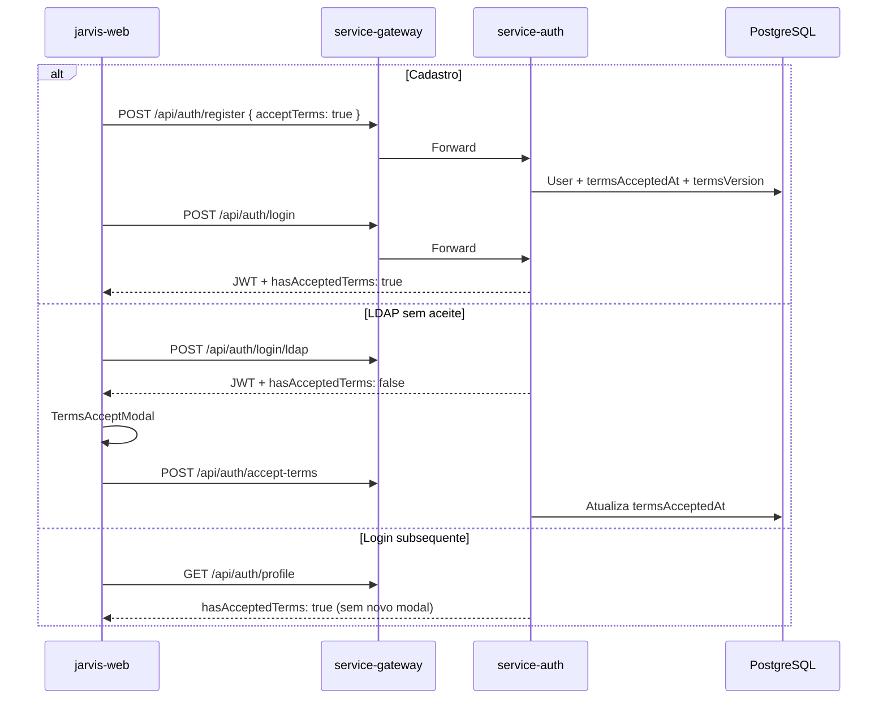
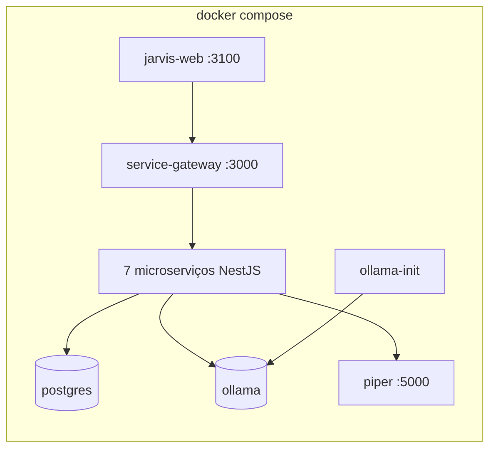
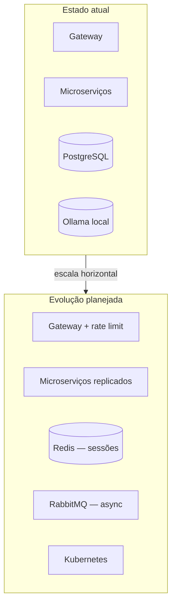

# Arquitetura MyJarvis

> **Autor:** Francisco Stanley Rodrigues Albuquerque

## Visão Geral

MyJarvis segue **Clean Architecture** com microserviços independentes, comunicando-se via HTTP REST através de um API Gateway. Stack 100% gratuita e open source.

## Contexto do Sistema

## Monorepo

## Clean Architecture (por microserviço)

### Regras de dependência

## Fluxo de Conversa JARVIS (RAG + Ações)

## Aprendizado Contínuo e Peer AIs

## Autenticação e Termos de Uso

## Deploy Docker

## Decisões de Design

- **Gateway único**: frontend nunca acessa serviços internos diretamente
- **Ports & Adapters**: Ollama, DuckDuckGo, Piper etc. são substituíveis sem alterar use cases
- **RAG local**: 45 chunks (ações + dev + ética + fé + PM) + **memória aprendida persistente** filtrada por ética
- **Peer AIs**: `consult_peer_ai` via Ollama (`OLLAMA_PEER_MODELS`) — stack gratuita
- **Fé cristã evangélica batista**: worldview do JARVIS — `.cursor/skills/christian-faith/`
- **Gestão de projetos**: Scrum, problemas complexos, entrega segura — chunks `pm-knowledge.ts`
- **Termos de Uso**: aceite único no cadastro (`termsAcceptedAt`) — [terms-of-use.md](terms-of-use.md)
- **Aprendizado contínuo**: `web_search` + `doc_search` — JARVIS não limitado ao RAG estático
- **Sessões in-memory**: conversas em memória (Redis reservado para produção futura)
- **PWA**: mobile via Progressive Web App, sem app nativo separado
- **Stack gratuito**: sem APIs pagas — ver [free-stack.md](free-stack.md)

## Escalabilidade Futura

