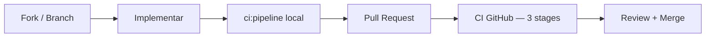

# Contribuindo

Obrigado por considerar contribuir com o MyJarvis!

> **Fonte canônica:** este arquivo em `docs/contributing.md`. A [wiki GitHub](https://github.com/FranciscoStanley/MyJarvis/wiki/Contributing) espelha este conteúdo.

---

## Fluxo de contribuição



---

## Antes de começar

1. Leia [Início Rápido](getting-started.md) e [Arquitetura](architecture.md)
2. Entenda [Clean Architecture](../.cursor/skills/clean-architecture/SKILL.md) e [Stack Gratuito](free-stack.md)
3. Configure o ambiente: `docker compose up -d --build`

---

## Branches

| Branch | Uso |
|--------|-----|
| `master` | Produção — protegida, PR obrigatório |
| `feature/*` | Novas funcionalidades |
| `fix/*` | Correções de bugs |
| `docs/*` | Documentação |
| `ci/*` | Pipeline e infraestrutura |

---

## Commits

Use [Conventional Commits](https://www.conventionalcommits.org/):

```
feat(ai): adiciona suporte a tool calling para busca
fix(gateway): corrige sanitização de path traversal
docs(wiki): atualiza API reference
ci(test): compila shared antes dos testes unitários
chore(deps): atualiza nestjs para 11.0.8
```

**Regras:**

- Um commit = uma intenção
- Mensagem em português ou inglês (consistente no PR)
- Nunca commitar `.env`, secrets ou `node_modules/`

Skill detalhada: `.cursor/skills/organize-commits/SKILL.md`

---

## Pipeline obrigatório

```bash
npm run ci:pipeline
```

| Etapa | Valida |
|-------|--------|
| Stage 1 | Lint + testes unitários |
| Stage 2 | Build + integração |
| Stage 3 | E2E Playwright + audit gate |

O hook `pre-push` (Husky) executa o pipeline automaticamente.

---

## Padrões de código

| Área | Padrão |
|------|--------|
| Backend | Clean Architecture, SOLID, NestJS modules |
| Frontend | App Router, Tailwind, Zustand |
| Testes | Vitest (unit/integration), Playwright (E2E) |
| API | Swagger decorators em todo controller |
| Docs | Atualizar Swagger, README, Postman/Insomnia |

---

## Ao alterar APIs

1. Atualizar DTOs e decorators Swagger
2. Atualizar testes correspondentes
3. Atualizar `docs/postman/` e `docs/insomnia/`
4. Atualizar [API Reference](api.md)

---

## Dependências

Antes de adicionar qualquer pacote:

1. Licença MIT, Apache 2.0, BSD ou domínio público
2. **Sem API key paga**
3. Documentar em `docs/free-stack.md`

---

## Pull Request

1. Crie branch a partir de `master`
2. Implemente com testes
3. Rode `npm run ci:pipeline`
4. Abra PR com descrição clara:

```markdown
## Resumo
- O que mudou e por quê

## Test plan
- [ ] ci:pipeline passou localmente
- [ ] Testei manualmente X
```

5. Aguarde CI verde (3 stages) + review

---

## Cursor IDE

O projeto inclui rules e skills em `.cursor/`:

| Skill | Quando usar |
|-------|-------------|
| `myjarvis-development` | Orquestrador geral |
| `nestjs-services` | Backend / APIs |
| `nextjs-frontend` | Frontend |
| `clean-architecture` | Use cases e ports |
| `review-code` | Antes de push/PR |

---

## Código de conduta

- Respeito e colaboração
- Feedback construtivo em reviews
- Foco na qualidade, não na quantidade

---

## Autor

**Francisco Stanley Rodrigues Albuquerque**

Dúvidas? Abra uma [Issue](https://github.com/FranciscoStanley/MyJarvis/issues) no GitHub.
