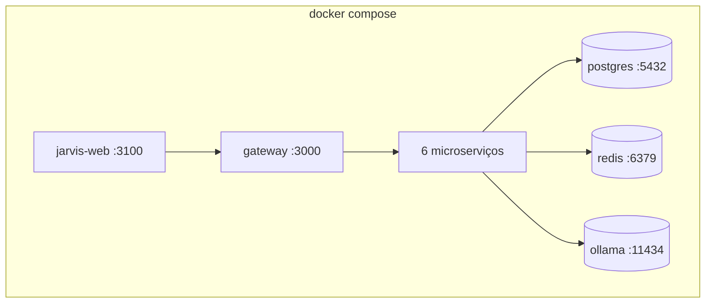

# Deployment

Guia de implantação com Docker Compose — desenvolvimento e produção.

> **Fonte canônica:** este arquivo em `docs/deployment.md`. A [wiki GitHub](https://github.com/FranciscoStanley/MyJarvis/wiki/Deployment) espelha este conteúdo.

---

## Docker Compose (recomendado)

```bash
cp .env.example .env
docker compose up -d --build
docker compose exec ollama ollama pull llama3.2
```

### Serviços orquestrados



---

## Comandos úteis

| Comando | Descrição |
|---------|-----------|
| `docker compose up -d --build` | Subir/rebuildar stack |
| `docker compose down` | Parar e remover containers |
| `docker compose logs -f service-ai` | Logs de um serviço |
| `docker compose ps` | Status dos containers |
| `npm run docker:up` | Atalho com script customizado |

---

## Portas expostas

| Serviço | Porta host | Protocolo |
|---------|------------|-----------|
| jarvis-web | 3100 | HTTP |
| service-gateway | 3000 | HTTP |
| PostgreSQL | 5432 | TCP |
| Redis | 6379 | TCP |
| Ollama | 11434 | HTTP |

Microserviços internos (3001–3006) ficam na rede Docker — acessíveis via gateway.

---

## Build de produção

Cada serviço possui `Dockerfile` multi-stage:

1. **Build** — `npm ci` + `nest build` / `next build`
2. **Runtime** — imagem slim com apenas `dist/` e deps de produção

```bash
docker compose build --no-cache
```

---

## Checklist de produção

| Item | Ação |
|------|------|
| `JWT_SECRET` | Gerar secret forte (256+ bits) |
| `DATABASE_URL` | PostgreSQL com senha forte |
| `ADMIN_SEED_*` | Remover ou alterar credenciais padrão |
| HTTPS | Colocar reverse proxy (Nginx/Caddy) na frente |
| Ollama | Garantir RAM/GPU suficiente |
| Backups | Agendar backup do volume PostgreSQL **e** do volume `jarvis_learning_data` (conversas + aprendizado) |
| Logs | Configurar rotação de logs Docker |

---

## Reverse proxy (exemplo Nginx)

```nginx
server {
    listen 443 ssl;
    server_name jarvis.seudominio.com;

    location / {
        proxy_pass http://localhost:3100;
    }

    location /api {
        proxy_pass http://localhost:3000;
        proxy_set_header Authorization $http_authorization;
    }
}
```

---

## Recursos mínimos

| Cenário | CPU | RAM | Disco |
|---------|-----|-----|-------|
| Dev local | 2 cores | 4 GB | 10 GB |
| Produção leve | 4 cores | 8 GB | 20 GB |
| Produção + GPU | 4+ cores | 16 GB | 30 GB |

Ollama com Llama 3.2 consome ~2–4 GB de RAM durante inferência.

### Volume de dados (`jarvis_learning_data`)

Montado em `/app/data` no `service-ai`:

| Caminho no container | Conteúdo |
|----------------------|----------|
| `/app/data/jarvis-learned-knowledge.json` | Memória de aprendizado JARVIS |
| `/app/data/conversations/{userId}.json` | Histórico de conversas por usuário |

Faça backup deste volume em produção junto com o PostgreSQL.

---

## Leitura complementar

- [Variáveis de Ambiente](environment-variables.md)
- [Início Rápido](getting-started.md)
- [Boas Práticas de Segurança](security.md)
