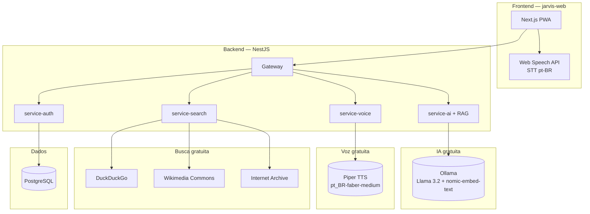

# Stack Gratuito — MyJarvis

MyJarvis usa **apenas tecnologias gratuitas e open source**. Nenhuma API paga ou licença comercial é necessária.

## Mapa de Tecnologias



## Matriz de Tecnologias

| Função | Tecnologia | Licença | Custo |
|--------|-----------|---------|-------|
| **IA / Chat** | [Ollama](https://ollama.com) + Llama 3.2 | MIT | Grátis (local) |
| **RAG / Embeddings** | Ollama + nomic-embed-text | Apache 2.0 | Grátis (local) |
| **Busca web** | DuckDuckGo API + duck-duck-scrape | MIT | Grátis |
| **Imagens** | DuckDuckGo + Wikimedia Commons | MIT / CC | Grátis |
| **Vídeos** | DuckDuckGo Videos | MIT | Grátis |
| **Música** | Internet Archive | Domínio público | Grátis |
| **Voz (STT)** | Web Speech API (navegador) | W3C padrão | Grátis |
| **Voz (TTS)** | Piper TTS (`pt_BR-faber-medium`) + fallback Web Speech pt-BR | MIT / W3C | Grátis |
| **Backend** | NestJS | MIT | Grátis |
| **Frontend** | Next.js | MIT | Grátis |
| **Banco** | PostgreSQL | PostgreSQL License | Grátis |
| **Cache** | Redis (reservado — compose only) | BSD | Grátis |

## O que NÃO usamos

- OpenAI / GPT (pago por token)
- SerpAPI (pago)
- Unsplash API (limites comerciais)
- YouTube Data API (cota / termos)
- Spotify API (restrito)
- Azure Speech (pago)
- Serviços com licença comercial obrigatória

## Configurar Ollama (IA)

```bash
# Com Docker
docker compose up -d ollama

# Baixar modelo (primeira vez, ~2GB)
docker compose exec ollama ollama pull llama3.2

# Testar
curl http://localhost:11434/api/chat -d '{
  "model": "llama3.2",
  "messages": [{"role": "user", "content": "Olá"}],
  "stream": false
}'
```

Modelos recomendados (todos gratuitos):
- `llama3.2` — equilíbrio qualidade/velocidade (chat)
- `nomic-embed-text` — embeddings RAG (~274MB)
- `mistral` — rápido, bom em português
- `gemma2` — leve para máquinas modestas

## RAG — contexto para ações, dev agent e ética

O `service-ai` usa RAG local com **45 chunks** (ações + dev + ética + fé + PM), **memória aprendida** e ferramentas gratuitas:

| Capacidade | Implementação gratuita |
|------------|------------------------|
| Embeddings | Ollama `nomic-embed-text` |
| `doc_search` | DuckDuckGo `site:dominio` (docs oficiais) |
| `consult_peer_ai` | Outros modelos Ollama locais (mistral, gemma2) |
| Aprendizado | JSON persistente (`LEARNING_DATA_PATH`) — filtrado por ética |
| `web_search` | DuckDuckGo (aprendizado contínuo) |
| Guardrails | Chunks `ethics-knowledge.ts` + prompt (sem API paga) |

```bash
# Modelo de embedding (docker compose puxa automaticamente via ollama-init)
docker compose exec ollama ollama pull nomic-embed-text

# Verificar índice RAG (chunks: 45) + memória aprendida
curl http://localhost:3002/api/health
```

Se embeddings estiverem offline, o RAG usa **fallback por keywords** — continua funcional com precisão reduzida.

Variável: `OLLAMA_EMBED_MODEL=nomic-embed-text` (ver `.env.example`).

## Voz — Piper TTS + navegador

- **Entrada (STT):** Web Speech API no Chrome/Edge (pt-BR)
- **Saída (TTS):** Piper no Docker (`piper` service) — voz masculina `pt_BR-faber-medium`
- **Fallback:** se Piper estiver offline, o app usa `speechSynthesis` pt-BR

```bash
# Subir stack (inclui piper na porta 5000)
docker compose up -d piper service-voice

# Testar síntese
curl -X POST http://localhost:3000/api/voice/synthesize \
  -H "Authorization: Bearer $TOKEN" \
  -H "Content-Type: application/json" \
  -d '{"text":"Good morning, sir."}'
```

Variáveis: `PIPER_URL`, `PIPER_VOICE`, `PIPER_LENGTH_SCALE` (ver `.env.example`).

Requisitos STT no navegador:
- Chrome ou Edge (melhor suporte STT em pt-BR)
- HTTPS ou localhost
- Permissão de microfone

## Busca na internet

Todas as buscas usam fontes públicas:
- **DuckDuckGo** — sem rastreamento, sem API key
- **Wikimedia Commons** — imagens com licenças livres
- **Internet Archive** — música e áudio histórico gratuito
