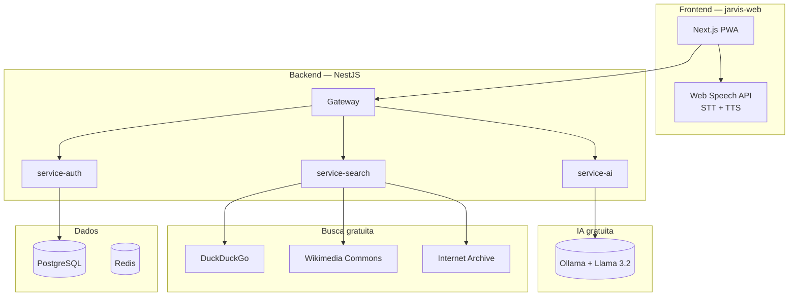

# Stack Gratuito — MyJarvis

MyJarvis usa **apenas tecnologias gratuitas e open source**. Nenhuma API paga ou licença comercial é necessária.

## Mapa de Tecnologias



## Matriz de Tecnologias

| Função | Tecnologia | Licença | Custo |
|--------|-----------|---------|-------|
| **IA / Chat** | [Ollama](https://ollama.com) + Llama 3.2 | MIT | Grátis (local) |
| **Busca web** | DuckDuckGo API + duck-duck-scrape | MIT | Grátis |
| **Imagens** | DuckDuckGo + Wikimedia Commons | MIT / CC | Grátis |
| **Vídeos** | DuckDuckGo Videos | MIT | Grátis |
| **Música** | Internet Archive | Domínio público | Grátis |
| **Voz (STT)** | Web Speech API (navegador) | W3C padrão | Grátis |
| **Voz (TTS)** | Web Speech Synthesis (navegador) | W3C padrão | Grátis |
| **Backend** | NestJS | MIT | Grátis |
| **Frontend** | Next.js | MIT | Grátis |
| **Banco** | PostgreSQL | PostgreSQL License | Grátis |
| **Cache** | Redis | BSD | Grátis |

## O que NÃO usamos

- OpenAI / GPT (pago por token)
- SerpAPI (pago)
- Unsplash API (limites comerciais)
- YouTube Data API (cota / termos)
- Spotify API (restrito)
- Azure Speech (pago)
- Serviços com licença comercial obrigatória

## Configurar Ollama (IA)

```bash
# Com Docker
docker compose up -d ollama

# Baixar modelo (primeira vez, ~2GB)
docker compose exec ollama ollama pull llama3.2

# Testar
curl http://localhost:11434/api/chat -d '{
  "model": "llama3.2",
  "messages": [{"role": "user", "content": "Olá"}],
  "stream": false
}'
```

Modelos recomendados (todos gratuitos):
- `llama3.2` — equilíbrio qualidade/velocidade
- `mistral` — rápido, bom em português
- `gemma2` — leve para máquinas modestas

## Voz no navegador

A transcrição e síntese de voz acontecem **no dispositivo do usuário** via APIs nativas do Chrome/Edge/Safari — sem enviar áudio para serviços pagos.

Requisitos:
- Chrome ou Edge (melhor suporte STT em pt-BR)
- HTTPS ou localhost
- Permissão de microfone

## Busca na internet

Todas as buscas usam fontes públicas:
- **DuckDuckGo** — sem rastreamento, sem API key
- **Wikimedia Commons** — imagens com licenças livres
- **Internet Archive** — música e áudio histórico gratuito
