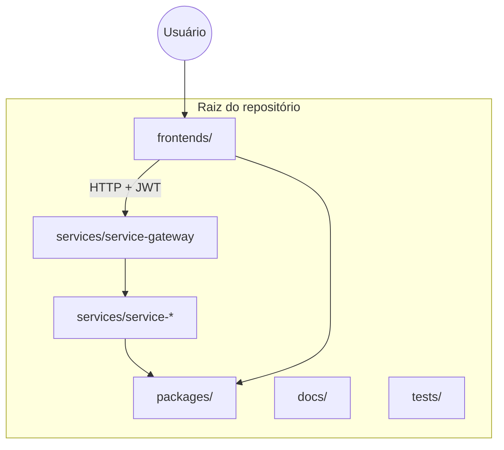
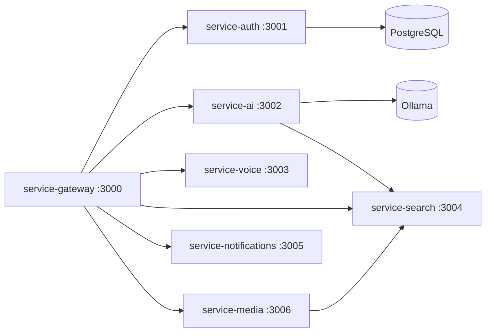
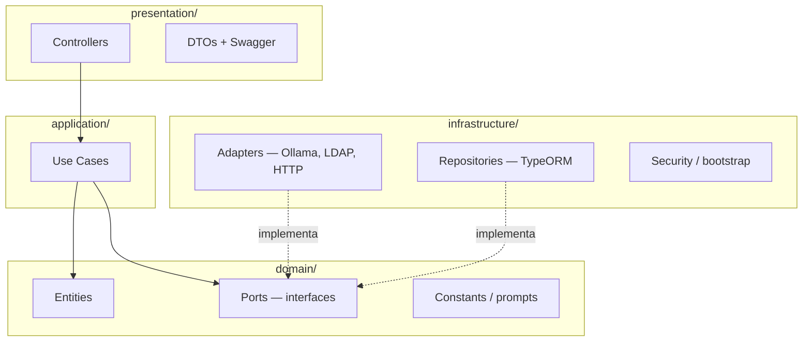
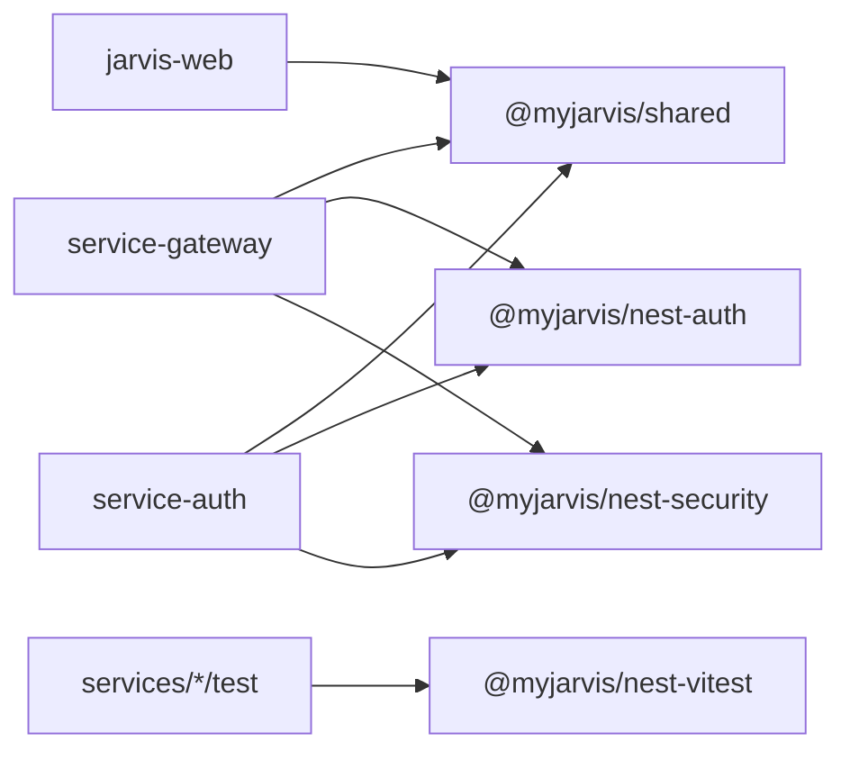
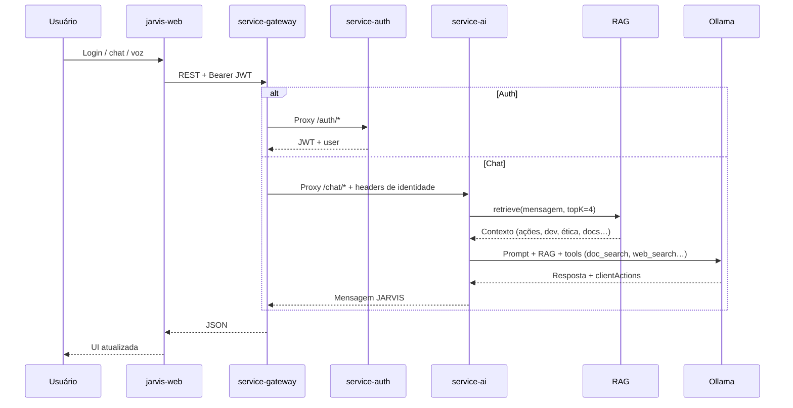

# Estrutura de Pastas — MyJarvis

> **Autor:** Francisco Stanley Rodrigues Albuquerque  
> Guia de referência: o que cada pasta representa, o que ela **não** faz e como as partes se conectam.

---

## Visão geral

O MyJarvis é um **monorepo npm** organizado em camadas: frontend, gateway, microserviços, pacotes compartilhados, testes cross-service e documentação. O usuário interage apenas com o frontend; o backend fala entre si pela rede interna (Docker).

| Camada | Pasta | Responsabilidade em uma frase |
|--------|-------|--------------------------------|
| Interface | `frontends/` | UI, voz no browser, PWA |
| Entrada | `services/service-gateway` | Único ponto público da API |
| Domínio | `services/service-*` | Lógica de negócio por capacidade |
| Biblioteca | `packages/` | Código reutilizável entre serviços |
| Qualidade | `tests/` | Testes que cruzam serviços |
| Conhecimento | `docs/` | Arquitetura, API, segurança, testes |

---

## Raiz do repositório

Arquivos e pastas no nível superior do projeto.

| Item | Tipo | Responsabilidade |
|------|------|------------------|
| `package.json` | Arquivo | Workspace raiz: scripts globais (`dev`, `build`, `ci:pipeline`, testes) |
| `package-lock.json` | Arquivo | Lock de dependências de todo o monorepo |
| `docker-compose.yml` | Arquivo | Orquestra PostgreSQL, Ollama, Piper, ollama-init e todos os containers |
| `.env.example` | Arquivo | Modelo de variáveis de ambiente (copiar para `.env`) |
| `LICENSE` | Arquivo | Licença MIT e copyright |
| `README.md` | Arquivo | Visão geral, início rápido e links para documentação |
| `node_modules/` | Pasta | Dependências instaladas (não versionar) |

---

## `frontends/` — Interface com o usuário

Contém aplicações web ou mobile. Hoje há um único frontend.

### `frontends/jarvis-web/` (porta **3100**)

Aplicação **Next.js PWA** — orb JARVIS, chat, autenticação e voz no navegador.

| Subpasta / arquivo | Responsabilidade |
|--------------------|------------------|
| `src/app/` | Rotas App Router (`layout.tsx`, `page.tsx`, `/terms`, `/privacy`) |
| `src/components/jarvis/` | UI: orb, chat, entrada, `AuthModal`, `TermsAcceptModal` |
| `src/stores/` | Estado global (Zustand): sessão, JWT, roles, `needsTermsAcceptance`, mensagens |
| `src/hooks/` | Lógica reutilizável (ex.: `useVoice` — Web Speech API) |
| `src/lib/api.ts` | Cliente HTTP centralizado — fala **somente** com o gateway |
| `src/test/` | Setup Vitest e mocks (ex.: Framer Motion) |
| `public/` | Assets estáticos, ícones PWA, `manifest.json` |
| `e2e/` | Testes end-to-end Playwright |
| `Dockerfile` | Imagem de produção (standalone Next.js) |

**Não faz:** regras de negócio de IA, auth no servidor ou acesso direto a microserviços internos.

---

## `services/` — Microserviços backend

Cada serviço é um app **NestJS** independente: `package.json`, `Dockerfile`, testes e deploy próprios. Seguem **Clean Architecture** (detalhes abaixo).

### Mapa de serviços

| Serviço | Porta | Função principal |
|---------|-------|------------------|
| `service-gateway` | 3000 | Proxy, JWT, rate limit, CORS — **única API pública** |
| `service-auth` | 3001 | Login, registro, LDAP, RBAC, usuários |
| `service-ai` | 3002 | Chat JARVIS via Ollama, sessões, personalidade |
| `service-voice` | 3003 | TTS via Piper (HTTP); STT no browser (Web Speech API) |
| `service-search` | 3004 | Busca web, imagens, vídeos, músicas (fontes gratuitas) |
| `service-notifications` | 3005 | Enviar, listar e marcar notificações |
| `service-media` | 3006 | Resolver URLs de mídia (música/vídeo) via search |

### Detalhe por serviço

#### `service-gateway`

| Responsabilidade | Detalhe |
|------------------|---------|
| Roteamento | Encaminha `/auth/*`, `/chat/*`, `/voice/*`, `/search/*`, `/notifications/*`, `/media/*` |
| Segurança | Valida JWT, Helmet, throttling, sanitização de paths no proxy |
| Identidade | Repassa `X-User-Id`, `X-User-Email`, `X-User-Roles` aos serviços internos |
| Documentação | Swagger agregado em `/api/docs` (dev) |

**Não faz:** lógica de chat, auth ou busca — apenas proxy e guards.

#### `service-auth`

| Responsabilidade | Detalhe |
|------------------|---------|
| Autenticação | Email/senha, LDAP/AD, emissão de JWT |
| Termos de Uso | `acceptTerms` no cadastro; `POST /auth/accept-terms` (aceite único por versão) |
| Autorização | RBAC (`user`, `admin`), gestão de papéis |
| Persistência | Usuários em PostgreSQL (`termsAcceptedAt`, `termsVersion`) |
| Proteção | Rate limit, lockout por tentativas, política de senha |

**Não faz:** proxy para o frontend — o browser usa o gateway.

#### `service-ai`

| Responsabilidade | Detalhe |
|------------------|---------|
| Conversação | Sessões, histórico, envio de mensagens ao JARVIS |
| IA | Integração Ollama (modelo local, ex.: Llama 3.2) |
| **RAG** | 45 chunks: ações + dev + ética + fé + PM (`knowledge-index.ts`) |
| **Aprendizado** | Memória persistente JSON + `learning-validator` + recall no prompt |
| **Peer AIs** | `consult_peer_ai` via Ollama (`OLLAMA_PEER_MODELS`) |
| Personalidade | System prompt + guardrails + fé evangélica batista |
| Ferramentas | `doc_search`, `web_search`, `consult_peer_ai`, tool calling + `service-search` |
| Ações cliente | `clientActions` (YouTube, Google, Cursor, VS Code, embed) |

**Não faz:** renderizar UI nem hospedar o modelo (Ollama é processo separado).

Estrutura RAG em `services/service-ai/src/`:

| Pasta / arquivo | Função |
|-----------------|--------|
| `domain/knowledge/action-knowledge.ts` | Chunks de ações (browser, YouTube, Cursor, VS Code) |
| `domain/knowledge/dev-knowledge.ts` | Agente de desenvolvimento (review, refactor, blueprint) |
| `domain/knowledge/ethics-knowledge.ts` | Guardrails de segurança e ética |
| `domain/knowledge/faith-knowledge.ts` | Fé cristã evangélica batista |
| `domain/knowledge/pm-knowledge.ts` | Gestão de projetos e problemas complexos |
| `domain/knowledge/knowledge-index.ts` | Índice unificado RAG (45 chunks) |
| `domain/services/learning-validator.ts` | Filtro ético antes de persistir aprendizado |
| `infrastructure/adapters/file-learning-store.adapter.ts` | Memória persistente JSON |
| `infrastructure/adapters/ollama-peer.adapter.ts` | Consulta a outros modelos Ollama |
| `application/services/context-enrichment.service.ts` | RAG + memória aprendida no prompt |
| `domain/constants/doc-registry.ts` | Mapa de documentações oficiais (30+ tecnologias) |
| `domain/services/doc-search.ts` | Queries `site:dominio` para `doc_search` |
| `domain/ports/rag.port.ts` | Interface `RagPort` |
| `infrastructure/adapters/ollama-rag.adapter.ts` | Retrieve + embeddings |
| `domain/services/action-intent.ts` | Detecção de execução imediata |
| `infrastructure/adapters/action-detector.ts` | Fallback regex quando LLM falha |

#### `service-search`

| Responsabilidade | Detalhe |
|------------------|---------|
| Busca web | DuckDuckGo e fontes abertas |
| Multimídia | Imagens (Wikimedia), vídeos/músicas (Archive.org etc.) |

**Não faz:** chat ou armazenamento de conversas.

#### `service-voice`

| Responsabilidade | Detalhe |
|------------------|---------|
| TTS | Síntese via Piper HTTP (`PiperVoiceAdapter`) — voz `pt_BR-faber-medium` |
| STT | Orienta uso do Web Speech API no browser (`clientSide: true`) |
| Fallback | Retorna metadados para `speechSynthesis` quando Piper offline |

#### `service-notifications`

| Responsabilidade | Detalhe |
|------------------|---------|
| Notificações | Criar, listar por usuário, marcar como lida |

#### `service-media`

| Responsabilidade | Detalhe |
|------------------|---------|
| Mídia | Buscar e devolver URLs reproduzíveis de música/vídeo |
| Integração | Delega busca ao `service-search` |

---

### Anatomia interna de um microserviço

Estrutura típica em `services/<nome>/src/`:

| Camada | Pasta | O que guarda | Pode importar |
|--------|-------|--------------|---------------|
| **Domain** | `domain/` | Entidades, ports, constantes de negócio | Nada de infra ou framework |
| **Application** | `application/` | Use cases (uma operação por classe) | Domain |
| **Infrastructure** | `infrastructure/` | Adapters, repositórios, LDAP, segurança | Domain (+ libs externas) |
| **Presentation** | `presentation/` | Controllers, DTOs, validação HTTP | Application, Domain |

Outros arquivos comuns em cada serviço:

| Arquivo / pasta | Função |
|-----------------|--------|
| `src/main.ts` | Bootstrap NestJS, Swagger, middlewares |
| `src/app.module.ts` | Módulo raiz, DI, providers |
| `test/` | Testes unitários, integração e performance (Vitest) |
| `Dockerfile` | Build multi-stage para container |
| `nest-cli.json` | Configuração do CLI NestJS |

---

## `packages/` — Bibliotecas compartilhadas

Código publicado apenas dentro do monorepo (`"private": true`). Evita duplicação entre gateway, auth e frontends.

| Pacote | Consumidores | Responsabilidade |
|--------|--------------|------------------|
| `@myjarvis/shared` | Todos | Tipos, DTOs, roles JWT, constantes (`SERVICE_PORTS`, `PROJECT_AUTHOR`) |
| `@myjarvis/nest-auth` | Gateway, Auth | Guards JWT/RBAC, decorators `@Public()`, `@Roles()`, rate limit de auth |
| `@myjarvis/nest-security` | Gateway, Auth | Helmet, ValidationPipe estrito, sanitização de proxy, checagem de JWT |
| `@myjarvis/nest-vitest` | Serviços (testes) | Setup Vitest + SWC para injeção NestJS em testes |

**Não faz:** expor endpoints HTTP — são bibliotecas, não serviços.

---

## `tests/` — Suíte cross-service (`@myjarvis/test-suite`)

Testes que **não pertencem a um único microserviço** — validam o sistema como um todo ou sob carga.

| Subpasta | Responsabilidade |
|----------|------------------|
| `integration/` | HTTP live contra gateway (serviços rodando) |
| `performance/` | Benchmarks (Autocannon) |
| `stress/` | Testes de stress do gateway |
| `k6/` | Scripts k6 (load e stress) |
| `helpers/` | Config compartilhada, utilitários live |

Cada serviço mantém **seus próprios** testes em `services/<nome>/test/`. A pasta `tests/` complementa com visão de sistema.

---

## `docs/` — Documentação técnica

| Arquivo / pasta | Conteúdo |
|-----------------|----------|
| `architecture.md` | Diagramas Mermaid, fluxos (chat, termos, RAG), decisões |
| `api.md` | Referência de endpoints via gateway |
| `terms-of-use.md` | Termos de Uso (versão `2026-06-01`) |
| `privacy-policy.md` | Política de Privacidade |
| `security.md` | JWT, rate limit, proxy, checklist de produção |
| `rbac-ldap.md` | Papéis, login LDAP, seed admin |
| `testing.md` | Tipos de teste, CI em 3 etapas, comandos |
| `free-stack.md` | Stack 100% gratuita (Ollama, DuckDuckGo, etc.) |
| `project-structure.md` | Este documento |
| `postman/` | Collection Postman da API |
| `insomnia/` | Workspace Insomnia exportado |

**Regra:** ao mudar contratos ou comportamento visível, atualizar o doc correspondente.

---

## `scripts/` — Automação pontual

| Caminho | Responsabilidade |
|---------|------------------|
| `scripts/ci/audit-gate.mjs` | Gate de auditoria npm na etapa 3 do CI (vulnerabilidades) |

Scripts de rotina ficam no `package.json` raiz (`ci:stage1`, `docker:up`, etc.).

---

## `.github/` — Integração contínua remota

| Caminho | Responsabilidade |
|---------|------------------|
| `.github/workflows/ci.yml` | Pipeline GitHub Actions em 3 estágios (validate → build/integration → E2E/quality) |

Espelha os scripts `ci:stage*` do `package.json` raiz.

---

## `.husky/` — Git hooks locais

| Caminho | Responsabilidade |
|---------|------------------|
| `.husky/pre-push` | Executa `npm run ci:pipeline` antes de cada push |

Garante que o mesmo padrão de qualidade do CI rode na máquina do desenvolvedor.

---

## `.cursor/` — Configuração do Cursor IDE

Orienta o agente de IA durante o desenvolvimento (não faz parte do runtime da aplicação).

| Subpasta | Responsabilidade |
|----------|------------------|
| `.cursor/rules/` | Regras `.mdc` — contexto automático (arquitetura, NestJS, commits, CI) |
| `.cursor/skills/` | Skills `SKILL.md` — workflows detalhados para o agente |
| `GLOBAL-CURSOR-SETUP.md` | Link para convenções globais em `~/.cursor/skills/` |

Índice local: `.cursor/skills/README.md`.

---

## Fluxo de dados resumido

---

## Onde colocar código novo?

| Você vai… | Pasta de destino |
|-----------|------------------|
| Criar tela ou componente | `frontends/jarvis-web/src/` |
| Adicionar endpoint público | `service-gateway` (proxy) + serviço de domínio |
| Regra de negócio / use case | `services/<serviço>/src/application/` |
| Integração externa (Ollama, LDAP) | `services/<serviço>/src/infrastructure/adapters/` |
| Tipo ou DTO compartilhado | `packages/shared/src/` |
| Guard ou middleware Nest compartilhado | `packages/nest-auth` ou `nest-security` |
| Teste de um serviço isolado | `services/<serviço>/test/` |
| Teste live/perf/stress global | `tests/` |
| Documentar decisão ou API | `docs/` |

---

## Referências relacionadas

- [architecture.md](architecture.md) — diagramas e decisões técnicas  
- [api.md](api.md) — contratos HTTP  
- [testing.md](testing.md) — estratégia de testes  
- [security.md](security.md) — camadas de segurança  
