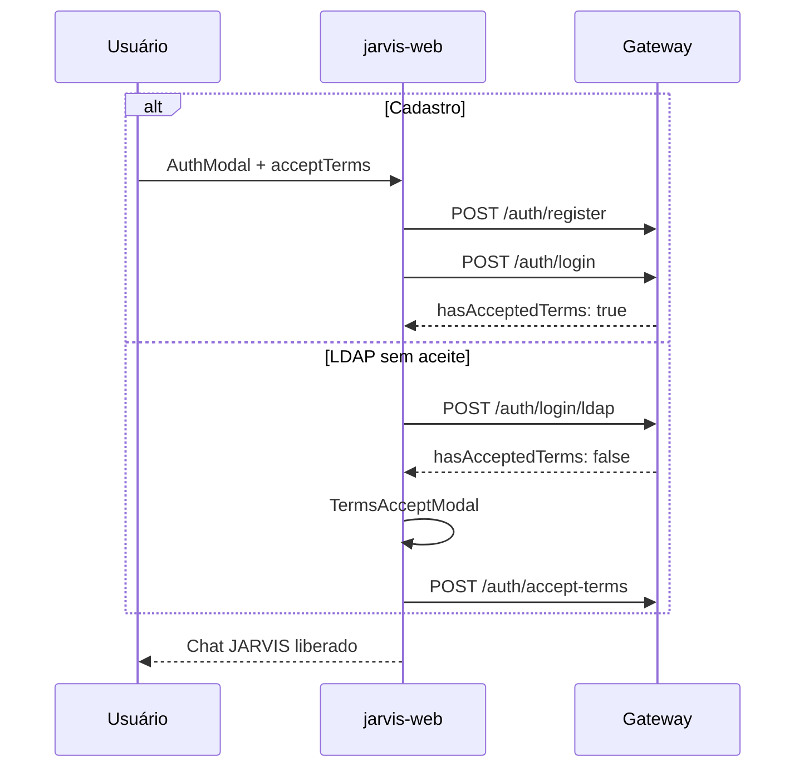

# jarvis-web

Frontend Next.js — interface web e mobile (PWA) do MyJarvis.

**Autor:** Francisco Stanley Rodrigues Albuquerque

- **Porta**: 3100
- **PWA**: Instalável em dispositivos móveis

## Features

- Orb animado JARVIS
- Chat por texto e voz (Web Speech API STT, pt-BR)
- TTS via Piper (`pt_BR-faber-medium`) com fallback `speechSynthesis`
- Execução automática de `clientActions` (YouTube, Google, Cursor, VS Code)
- **Termos de Uso**: checkbox no cadastro; modal de aceite único para LDAP/usuários legados
- Páginas legais: `/terms` e `/privacy`
- Gate de acesso: usuário autenticado sem `hasAcceptedTerms` vê `TermsAcceptModal` antes do chat
- Tema escuro elegante
- Responsivo mobile-first

## Fluxo de autenticação e termos



Documentação legal: [docs/terms-of-use.md](../../docs/terms-of-use.md) · [docs/privacy-policy.md](../../docs/privacy-policy.md)

## Desenvolvimento

```bash
npm run dev -w jarvis-web
npm run test -w jarvis-web
npm run test:e2e -w jarvis-web
```

Configure `NEXT_PUBLIC_API_URL=http://localhost:3000` no `.env`.

## Estrutura relevante

| Caminho | Função |
|---------|--------|
| `src/components/jarvis/AuthModal.tsx` | Login, registro com `acceptTerms` |
| `src/components/jarvis/TermsAcceptModal.tsx` | Aceite pós-login (LDAP) |
| `src/app/terms/page.tsx` | Termos de Uso |
| `src/app/privacy/page.tsx` | Política de Privacidade |
| `src/stores/jarvis.store.ts` | `needsTermsAcceptance`, `acceptTerms()` |
| `src/lib/api.ts` | Cliente HTTP — apenas gateway |

Skill: `.cursor/skills/nextjs-frontend/SKILL.md`
