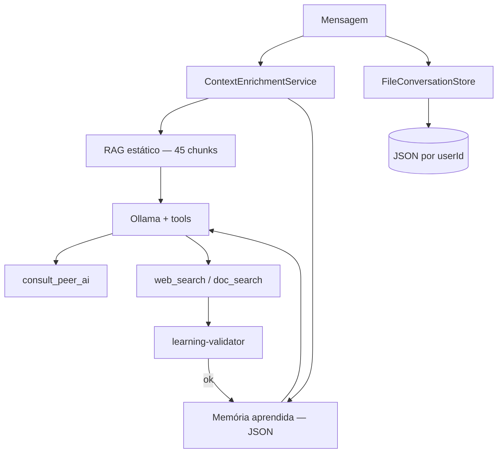

# service-ai

Cérebro JARVIS — conversação via **Ollama** com **RAG**, **aprendizado persistente**, **histórico de conversas**, **peer AIs**, **fé cristã evangélica batista**, **gestão de projetos** e **guardrails de segurança**.

**Autor:** Francisco Stanley Rodrigues Albuquerque

- **Porta**: 3002
- **Swagger**: http://localhost:3002/api/docs

## Papéis do JARVIS

| Papel | Descrição |
|-------|-----------|
| Assistente pessoal | Busca, mídia, apps, voz |
| Agente de desenvolvimento | Code review, refactor, blueprint, `doc_search` |
| Gestor de projetos | Scrum, WBS, RACI, problemas complexos, entrega segura |
| Worldview cristão | Evangelical batista — respeitoso, não impositivo |
| IA viva | Aprende e **persiste** conhecimento filtrado por ética |

Skills: `dev-agent` · `safety-guardrails` · `christian-faith` · `continuous-learning`

## Variáveis

| Variável | Padrão | Descrição |
|----------|--------|-----------|
| `OLLAMA_BASE_URL` | `http://localhost:11434` | URL do Ollama |
| `OLLAMA_MODEL` | `llama3.2` | Modelo principal |
| `OLLAMA_PEER_MODELS` | `mistral,gemma2` | Peers para `consult_peer_ai` |
| `LEARNING_DATA_PATH` | `./data/jarvis-learned-knowledge.json` | Memória persistente |
| `LEARNING_MAX_ENTRIES` | `500` | Limite de entradas |
| `CONVERSATIONS_DATA_DIR` | `./data/conversations` | Histórico de chat por usuário |
| `CONVERSATIONS_MAX_SESSIONS` | `50` | Máximo de conversas por usuário |
| `CONVERSATIONS_MAX_MESSAGES` | `200` | Máximo de mensagens por conversa |
| `SEARCH_SERVICE_URL` | `http://service-search:3004` | DuckDuckGo |

## RAG + Memória dinâmica



| Categoria RAG | Chunks | Arquivo |
|---------------|--------|---------|
| Ações | 11 | `action-knowledge.ts` |
| Dev Agent | 17 | `dev-knowledge.ts` |
| Ética | 5 | `ethics-knowledge.ts` |
| Fé cristã | 5 | `faith-knowledge.ts` |
| Gestão / problemas | 7 | `pm-knowledge.ts` |

Total dinâmico: `KNOWLEDGE_STATS.total` em `knowledge-index.ts`.

## Ferramentas

| Tool | Descrição |
|------|-----------|
| `doc_search` | Docs oficiais via DuckDuckGo `site:` |
| `web_search` | Aprendizado contínuo na internet |
| `consult_peer_ai` | Segunda opinião (outro modelo Ollama local) |
| `open_application` | Cursor, VS Code, YouTube, etc. |

## Aprendizado persistente

1. Busca ou conversa gera síntese útil
2. `learning-extractor` decide se persiste
3. `learning-validator` bloqueia conteúdo antiético/ilegal
4. `FileLearningStoreAdapter` salva em JSON (volume Docker `/app/data`)
5. Próximas conversas recuperam via `ContextEnrichmentService`

## Conversas persistentes

1. Gateway envia `X-User-Id` em cada requisição autenticada
2. `FileConversationStoreAdapter` grava `{userId}.json` em `CONVERSATIONS_DATA_DIR`
3. Título gerado automaticamente na primeira mensagem do usuário
4. Frontend lista, restaura e exclui conversas via API

## API

| Endpoint | Descrição |
|----------|-----------|
| `GET /chat/sessions` | Lista conversas do usuário |
| `POST /chat/session` | Nova conversa |
| `GET /chat/session/:id` | Histórico |
| `DELETE /chat/session/:id` | Excluir conversa |
| `POST /chat/message` | Chat completo |
| `GET /learning/stats` | Estatísticas da memória |
| `GET /health` | RAG + learning status |

## Desenvolvimento

```bash
npm run start:dev -w service-ai
npm run test:unit -w service-ai
```

Documentação: [docs/api.md](../../docs/api.md)
