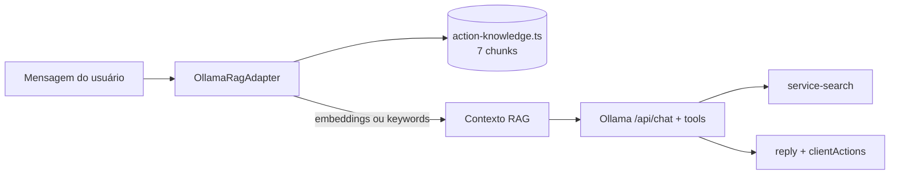

# service-ai

Cérebro JARVIS — conversação via **Ollama** (IA local, gratuita, MIT) com **RAG** para execução de ações.

**Autor:** Francisco Stanley Rodrigues Albuquerque

- **Porta**: 3002
- **Swagger**: http://localhost:3002/api/docs

## Requer

- Ollama em execução (`docker compose up ollama`)
- Modelos baixados:
  - `ollama pull llama3.2` — chat
  - `ollama pull nomic-embed-text` — embeddings RAG (opcional; fallback por keywords se indisponível)

## Variáveis

| Variável | Padrão | Descrição |
|----------|--------|-----------|
| `OLLAMA_BASE_URL` | `http://localhost:11434` | URL do Ollama |
| `OLLAMA_MODEL` | `llama3.2` | Modelo de chat |
| `OLLAMA_EMBED_MODEL` | `nomic-embed-text` | Modelo de embeddings RAG |
| `SEARCH_SERVICE_URL` | `http://service-search:3004` | Busca DuckDuckGo |

## RAG — Retrieval-Augmented Generation

O RAG injeta contexto relevante no system prompt antes de cada resposta, melhorando detecção de intenções (abrir navegador, YouTube, Google, música).



Arquivos principais:

- `src/domain/knowledge/action-knowledge.ts` — base de conhecimento
- `src/infrastructure/adapters/ollama-rag.adapter.ts` — retrieve + embeddings
- `src/infrastructure/adapters/ollama.adapter.ts` — injeta contexto RAG no prompt

## Fluxo de chat

1. **RAG** recupera top-3 chunks relevantes (YouTube, Google, navegador, etc.)
2. Ollama gera resposta + tool calls com contexto enriquecido
3. Se o LLM retorna tool_calls sem texto → fallback `buildActionAcknowledgement`
4. Buscas executadas via `service-search` quando aplicável
5. Segunda chamada Ollama **sintetiza** resposta conversacional com resultados
6. `clientActions` retornadas para o frontend executar no navegador

### Execução de ações

| Tipo de pedido | `requiresConfirmation` | Comportamento no PWA |
|----------------|------------------------|----------------------|
| Imperativo (`Abra o YouTube`, `Toque X`) | `false` | `window.open()` imediato |
| Sugestão após busca (`Posso abrir...?`) | `true` | Botões ou voz (`sim`/`não`) |

Confirmação: ações com `requiresConfirmation: true` exigem `sim`/`não`, botão na UI ou voz antes de `window.open`.

## Health

`GET /api/health` retorna status do serviço e do índice RAG:

```json
{
  "status": "ok",
  "service": "service-ai",
  "rag": { "ready": true, "embedModel": "nomic-embed-text", "chunks": 7 }
}
```

## Desenvolvimento

```bash
npm run start:dev -w service-ai
npm run test:unit -w service-ai
npm run test:integration -w service-ai
```
