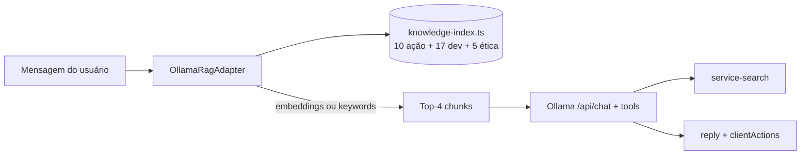

# service-ai

Cérebro JARVIS — conversação via **Ollama** (IA local, gratuita, MIT) com **RAG** para ações, **agente de desenvolvimento** e **guardrails de segurança**.

**Autor:** Francisco Stanley Rodrigues Albuquerque

- **Porta**: 3002
- **Swagger**: http://localhost:3002/api/docs

## Papel Triplo

JARVIS é **assistente pessoal** (busca, mídia, apps), **agente de codificação** (code review, refatoração, blueprint) e **assistente com ética** (recusa ataques/ilegalidades). Personalidade: tom britânico elegante com humor seco estilo Homem de Ferro.

Skills: `.cursor/skills/dev-agent/SKILL.md` · `.cursor/skills/safety-guardrails/SKILL.md`

## Requer

- Ollama em execução (`docker compose up ollama`)
- Modelos (baixados automaticamente via `ollama-init` no Docker):
  - `llama3.2` — chat
  - `nomic-embed-text` — embeddings RAG (fallback por keywords se indisponível)

## Variáveis

| Variável | Padrão | Descrição |
|----------|--------|-----------|
| `OLLAMA_BASE_URL` | `http://localhost:11434` | URL do Ollama |
| `OLLAMA_MODEL` | `llama3.2` | Modelo de chat |
| `OLLAMA_EMBED_MODEL` | `nomic-embed-text` | Modelo de embeddings RAG |
| `SEARCH_SERVICE_URL` | `http://service-search:3004` | Busca DuckDuckGo |

## RAG — Retrieval-Augmented Generation

O RAG injeta contexto relevante no system prompt antes de cada resposta — **32 chunks** em três categorias.



| Categoria | Arquivo | Conteúdo |
|-----------|---------|----------|
| Ações | `action-knowledge.ts` | YouTube, Gmail, Cursor, VS Code, navegador |
| Dev Agent | `dev-knowledge.ts` | Review, refactor, blueprint, `doc_search` |
| Ética | `ethics-knowledge.ts` | Recusa de ataques, LGPD, diretrizes do criador |

Arquivos principais:

- `src/domain/knowledge/knowledge-index.ts` — índice unificado (total dinâmico)
- `src/domain/constants/doc-registry.ts` — mapa de documentações oficiais (30+ tecnologias)
- `src/domain/services/doc-search.ts` — queries `site:dominio` para tool `doc_search`
- `src/domain/constants/jarvis-prompt.ts` — system prompt + personalidade + tools + guardrails
- `src/infrastructure/adapters/ollama-rag.adapter.ts` — retrieve + embeddings
- `src/infrastructure/adapters/ollama.adapter.ts` — injeta contexto RAG no prompt
- `src/infrastructure/adapters/action-detector.ts` — fallback regex (docs, segurança, apps)

## Ferramentas Ollama (tools)

| Tool | Descrição |
|------|-----------|
| `doc_search` | Documentação oficial via DuckDuckGo `site:` |
| `web_search` | Internet — aprendizado contínuo, CVEs, novidades |
| `image_search` / `video_search` / `music_search` | Mídia |
| `open_url` / `open_application` | URLs e apps (Cursor, VS Code, YouTube) |

## Fluxo de chat

1. **RAG** recupera top-4 chunks relevantes
2. Ollama gera resposta + tool calls com contexto enriquecido
3. Pedidos de ataque/ilegalidade → recusa com citação das diretrizes do criador
4. Buscas executadas via `service-search` quando aplicável
5. Segunda chamada Ollama **sintetiza** resposta conversacional com resultados
6. `clientActions` retornadas para o frontend executar no navegador

### Execução de ações

| Tipo de pedido | `requiresConfirmation` | Comportamento no PWA |
|----------------|------------------------|----------------------|
| Imperativo (`Abra o YouTube`, `Abra o Cursor`) | `false` | `window.open()` imediato |
| Sugestão após busca (`Posso abrir...?`) | `true` | Botões ou voz (`sim`/`não`) |

## Health

`GET /api/health` retorna status do serviço e do índice RAG:

```json
{
  "status": "ok",
  "service": "service-ai",
  "rag": { "ready": true, "embedModel": "nomic-embed-text", "chunks": 32 }
}
```

## Desenvolvimento

```bash
npm run start:dev -w service-ai
npm run test:unit -w service-ai
npm run test:integration -w service-ai
```

Documentação API: [docs/api.md](../../docs/api.md)
